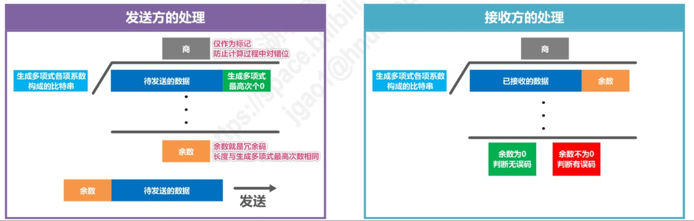

<!--
 * @Author: LetMeFly
 * @Date: 2022-06-07 09:19:32
 * @LastEditors: LetMeFly
 * @LastEditTime: 2022-06-07 15:52:34
-->
# 计算机网络

## 概述

**ISP(Internet Service Provider)**：因特网服务提供商

**三种报文交换方式**：

+ 电路交换(Circuit Switching)：先建立连接
+ 分组交换(Packet Switching)：分组
+ 报文交换(Message Switching)：整个

**计算机网络的定义**：

一些**互连**、**自治**的计算机网络**集合**

**按覆盖范围分**：

+ 广域网WAN(Wide Area Network)
+ 城域网MAN(Metropolitan Area Network)
+ 局域网LAN(Local Area Network)
+ 个域网PAN(Personal Area Network)

**按拓扑结构分**：

<li>总线型：</li>
<li>星型： </li>
<li>环形： </li>
<li>网状形： </li>

**带宽**：

+ 在模拟信号中：所包含的各种不同频率成分所占据的频率范围(例如：300Hz~3.4kHz，带宽为3.1kHz)
+ 在计算机网络中：单位时间内从网络中某点到零一点所能通过的“最高数据率”

**吞吐量**：

单位时间内通过某个网络（信道接口）的数据量

**时延**：

+ 发送时延：分组长度(b) / 发送速率(b/s)
+ 传播时延：信道长度(m) / 电磁波传播速率(m/s)
+ 处理时延：不固定，不方便计算

**时延带宽积**：

传播时延 × 带宽 -----------------------↘

第1个bit到达终点时，发送端已发送 (↘)个bit

又称为“以比特为单位的链路长度”

**往返时间**：RTT

**利用率**:

+ 信道利用率：百分之几的时间被利用
+ 网络利用率：全网信道利用率的加权平均

```
           ↗ 网络空闲时的时延      D↑
         D0                        |          | |   增长越来越快
D = --------------                 |         -  |
|       1 - U                      |      _-`   |
↓            ↘                  D0|___--`      |
当前网络时延    利用率            0+------------+----> U
```

**丢包率**：

丢包率 = 丢失分组数 / 总分组数

主要原因：分组误码、网络拥塞

**OSI体系结构**：

&nbsp;&nbsp;&nbsp;应用&nbsp;&nbsp;&nbsp;&nbsp;&nbsp;↑

&nbsp;&nbsp;&nbsp;表示&nbsp;&nbsp;&nbsp;&nbsp;&nbsp;↑

&nbsp;&nbsp;&nbsp;会话&nbsp;&nbsp;&nbsp;&nbsp;&nbsp;↑

&nbsp;&nbsp;&nbsp;运输&nbsp;&nbsp;&nbsp;&nbsp;&nbsp;↑

&nbsp;&nbsp;&nbsp;网络&nbsp;&nbsp;&nbsp;&nbsp;&nbsp;↑

数据链路 ↑

&nbsp;&nbsp;&nbsp;物理&nbsp;&nbsp;&nbsp;&nbsp;&nbsp;↑

**TCP/IP体系结构**

网络接口层、网际层、运输层、应用层

→→→→→→→→→→→→→→→→→→

学习时常用：

&nbsp;&nbsp;&nbsp;应用层&nbsp;&nbsp;&nbsp;&nbsp;↑  ：应用进程的交换来实现特定网络应用的问题

&nbsp;&nbsp;&nbsp;运输层&nbsp;&nbsp;&nbsp;&nbsp;↑  ：进程间基于网络的通信问题

&nbsp;&nbsp;&nbsp;网络层&nbsp;&nbsp;&nbsp;&nbsp;↑  ：分组在多个网络上传输(路由)问题

数据链路层↑  ：分组在一个网络(或一段链路)上的传输问题

&nbsp;&nbsp;&nbsp;物理层&nbsp;&nbsp;&nbsp;&nbsp;↑  ：何种信号表示何种比特

**专用术语**：

+ 实体
   + **实体**是任何可发送接收信息的硬件/软件进程
   + **对等实体**是通信双方相同层次中的实体
+ 协议
   + **语法**： 定义所交换信息的格式
   + **语义**： 定义收发双方索要完成的操作
   + **同步**： 定义收发双方的时序关系
+ 服务
   + 下层对上层提供服务，但下层的协议对上层是“透明(看不见)”的

## 物理层

**编码与调制**：

 

<center><small>图源：湖南大学教书匠</small></center>

**香农公式**：

c = W × log2(1 + S/N)

c：信道的极限信息传输速率(b/s)

W：信道带宽(Hz)

S：信道内所传信号的平均功率

N：信道内的高斯噪声功率

S/N：信噪比(dB)  10 × log10(S/N)

**奈氏准则**

理想低通信道的最高码元传输速率 = 2W Baud

波特率：码元传输速率

## 数据链路层

**奇校验**：添加一位校验位，是的“1”的个数为奇数

**循环冗余校验CRC(Cyclic Redundancy Check)**：

收发双方约定好一个生成多项式G(x)



例： G(x) = x^3 + x^2 + 1，发送101001

```
G(x) = 1·x^3 + 1·x^2 + 0·x^1 + 1·x^0
构成比特串：1101

发送：                                      接收：

待发送数据 + 生成多项式最高此项个数的0       接收方收到 101001001
101001 + 000 -> 101001000

              1 1 0 1 0 1                                 1 1 0 1 0 1
      ____________________                        ____________________  
1101 |  1 0 1 0 0 1 0 0 0                   1101 |  1 0 1 0 0 1 0 0 1
     丿 1 1 0 1                                  丿 1 1 0 1
       ⊕_________                                ⊕__________
          1 1 1 0                                     1 1 1 0
          1 1 0 1                                     1 1 0 1
        ⊕____________                              ⊕____________
              1 1 1 0                                     1 1 1 0
              1 1 0 1                                     1 1 0 1
            ⊕____________                              ⊕____________
                  1 1 0 0                                     1 1 0 1
                  1 1 0 1                                     1 1 0 1
                ⊕_________                                 ⊕_________
                        1                                           0

余数为1 -> 001                              余数为0，说明无误码
发送 ： 101001 + 001 -> 101001001
```

**点对点协议PPP**：

透明传输 —— 面向**字节**的**异步**链路采用插入转移字符的字节填充法

```
        首部              帧数据部分         尾部
  ________________ ____________________ __________
 | 7E | A | C | P |    7E    7D   03   | FSC | 7E |
 ---------------------/--\--/--\-/--\-------------
                     7D|5E 7D|5D 7D|23
                                      ↘每个ASCII码控制符(数值<0x20)
                                        前面插入7D，该字符加上0x20
```

透明传输 —— 面向**比特**的**同步**链路采用插入比特0的比特填充法

```
       首部           帧数据部分              尾部
  ____________ _________________________ ____________
 |01111110|...| 1...1010..01111110......|...|01111110|
 ------------------------------↑---------------------
                               0
        (一般由硬件实现)         ↘只要发现连续5个比特1，立即填充1个比特0
```

**以太网帧格式**：

+ 最小帧长64字节（512比特）
+ 最大帧长1518字节（5000 + 18）
+ 插入VLAN后的802.1Q帧的最大长度为1552字节（1500 + 22）

**必须使用退避算法**：

+ 发送帧前检测到忙
+ 重传数据帧
+ 发送成功后要发下一帧

## 网络层

**IP地址分类**：

+ ≤127：A类 （网络地址：左一字节）
+ 128 ~ 191：B类 （网络地址：左二字节）
+ 192 ~ 223：C类 （网络地址：左三字节）

**不能分配**：

+ A类的0、127
+ 主机号全0（网络地址）
+ 主机号全1（广播地址）

**分类编址的IPv4地址**：


|||隔离冲突域|隔离广播域|
|:--:|:--:|:--:|:--:|
|中继器/集线器|物理层|×|×|
|网桥/交换机|数据链路层|√|×|
|路由器|网络层|√|√|

## 运输层

```
  RIP             OSPF         BGP
   ↓               |            ↓
  UDP(端口号520)   |      TCP(端口号179)
   ↓17             ↓89          ↓6  } 协议字段的值
    _____________________________
   |              IP             |
   ------------------------------
```

**TCP和UDP**：

+ 用户数据报协议UDP(User Datagram Protocol)
   + 无连接
   + 一对一、一对多、多对多
   + 对应用层交付的报文直接打包
   + 尽最大努力交付（不可靠）
   + 不适用流量控制/拥塞控制
   + 首部开销小，仅8字节
+ 传输控制协议TCP(Transmission Control Protocol)
   + 面向连接
   + 每条TCP连接只能有2个端点EP（只能一对一）
   + 面向字节流
   + 可靠传输，使用流量控制和拥塞控制
   + 首部最小20字节，最大60字节

## 应用层

电子邮件、域名系统、文件传输、万维网...

## 名词解释

<details>
    <summary>名词解释</summary>
    <li>ACK  确认</li>
    <li>ADSL  非对称数字用户线</li>
    <li>ANSI  先进的加密标准</li>
    <li>AP  接入点/应用程序</li>
    <li>API  应用编程接口</li>
    <li>ARP  地址解析协议</li>
    <li>ARPA  美国国防部远景研究规划局（高级研究计划</li>署）
    <li>ARQ  自动重传请求</li>
    <li>AS  自治系统/鉴别服务器</li>
    <li>ATU  接入端接单元</li>
    <li>ATM  异步传递方式</li>
    <li>BGP  边界网关协议</li>
    <li>CCITT  国际电报电话咨询委员会</li>
    <li>CDMA  码分多址</li>
    <li>CHAP  口令握手鉴别协议</li>
    <li>CIDR  无分类域间路由选择</li>
    <li>CNNIC  中国互联网络信息中心</li>
    <li>CSMA/CD  载波监听多点接入/冲突检测</li>
    <li>CSMA/CA  载波监听多点接入/冲突避免</li>
    <li>DDOS  分布式拒绝服务</li>
    <li>DES  数据加密标准</li>
    <li>DHCP 动态主机配置协议</li>
    <li>DNS  域名服务</li>
    <li>EGP  外部网关协议</li>
    <li>EIA  美国电子工业协会</li>
    <li>FCS  帧检验序列</li>
    <li>FDDI  光纤分布式数据接口</li>
    <li>FDM  频分复用</li>
    <li>FTP  文件传送协议</li>
    <li>FIFO  先进先出</li>
    <li>GSM  全球移动通信系统，GSM体制</li>
    <li>HDLC  高级数据链路控制</li>
    <li>HFC  光纤同轴混合（网）</li>
    <li>HTML  超文本标记语言</li>
    <li>HTTP  超文本传送协议</li>
    <li>ICMP  网际控制报文协议</li>
    <li>IEEE  （美国）电气和电子工程师学会</li>
    <li>IGMP  网际组管理协议</li>
    <li>IGP  内部网关协议</li>
    <li>IMAP  网际报文存取协议</li>
    <li>IP  网际协议</li>
    <li>ISDN  综合业务数字网</li>
    <li>ISO  国际标准化组织</li>
    <li>ITU  国际电信联盟</li>
    <li>LAN  局域网</li>
    <li>MAN  城域网</li>
    <li>MPEG  活动图像专家组</li>
    <li>MTU  最大传送单元</li>
    <li>OSI/Rm  开放系统互连基本参考模型</li>
    <li>OSPF  开放最短通路优先</li>
    <li>PCM  脉码调制</li>
    <li>PDA  个人数字助理</li>
    <li>PKI  公钥基础结构</li>
    <li>PPP  点对点协议</li>
    <li>RIP  路由信息协议</li>
    <li>SMTP  简单邮件传送协议</li>
    <li>SSID  服务集标识符</li>
    <li>SSL  安全插口层，或安全套接层（协议）</li>
    <li>STDM  统计时分复用</li>
    <li>STP  屏蔽双绞线</li>
    <li>TCP  传输控制协议</li>
    <li>TDM  时分复用</li>
    <li>TIA  电信行业协会</li>
    <li>TLD  顶级域名</li>
    <li>TPDU  运输协议数据单元</li>
    <li>TTL  生存时间，或寿命</li>
    <li>UA  用户代理</li>
    <li>URL  统一资源定位符</li>
    <li>UTP  无屏蔽双绞线</li>
    <li>VLAN  虚拟局域网</li>
    <li>VLSM  变长子网掩码</li>
    <li>VPN  虚专用网</li>
    <li>WAN  广域网</li>
    <li>WDM  波分复用</li>
    <li>WI-FI  无线保真度（无线局域网的同义词）</li>
    <li>WLAN  无线局域网</li>
    <li>WWW  万维网</li>
    <li>NAT  网络地址转换</li>
    <li>NCP  网络控制协议</li>
</details>

