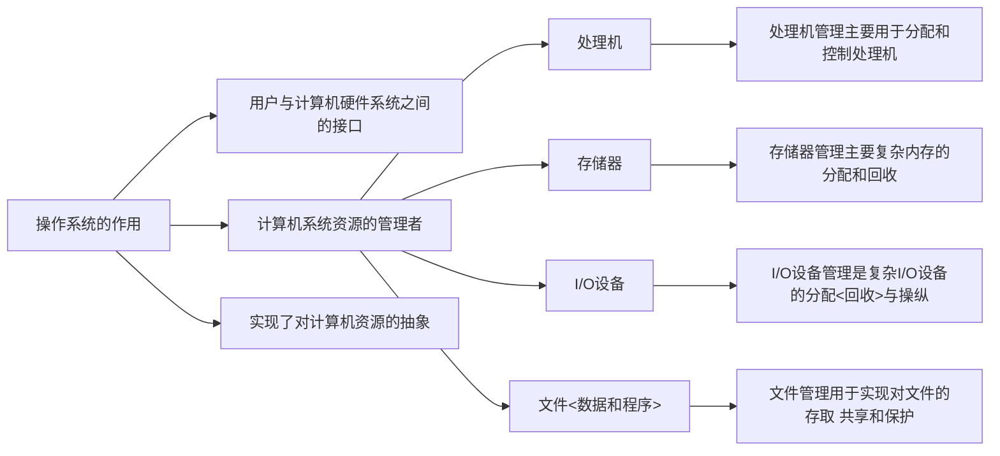

[TOC]


## 一、操作系统的发展历程

### 操作系统的特征

> + 并发(concurrency)
> + 共享(sharing)
> + 虚拟(virtual)
> + 异步性(asynchronism)

### 历史四种操作系统
#### 1.单道批处理系统
> 内存中始终只有一道作业运行
> + 处理过程：P6 (监督程序 Monitor)
> + 特点：
>   + 自动连续性 (无需人工干预，缺乏交互性)
>   + 顺序性 (磁盘/带上各程序先后进入内存，先进入先执行)
>   + 单道性 (内存中只有一道程序运行)

#### 2.多道批处理系统
> 内存中有多个作业，而某一时刻CPU处理的是其中一个作业
> （一个程序IO请求时先执行另一个程序）
> + SPOOLing技术 (Simultaneous Peripheral Operation On Line 假装脱机技术)
>   欺骗进程，像是每个进程都各自拥有一台打印机一样。
> + 特点：
>   + 资源利用率高
>   + 系统吞吐量大 (CPU和其他资源处于忙碌状态、仅当作业完成时或运行不下去时才进行切换)
>   + 平均周转时间长 (因要排队依次处理，故作业周转时间较长)
>   + 无交互能力


#### 3.分时系统
> 作业直接进入内存 ;采用轮转运行方式。
> + 关键问题：
>   + **及时接收**：配置多路卡，主机以很快的速度周期性地扫描各个终端，接收终端发来的数据。
>   + **及时处理**：不允许一个作业长期占用CPU，规定每个程序只允许很短的时间片(TimeSlice)后暂停，立刻调度下一个程序运行。
> + 特点：
>   + **多路性**：允许一台主机连接多个终端，按分时原则为每个用户服务。
>   + **独立性**：各用户独占一个终端互不干扰，感觉是独占主机。
>   + **及时性**：用户请求可在很短时间内得到响应。
>   + **交互性**：用户可通过终端与系统进行人机交互，获得系统服务。

##### 多道批处理系统 和 分时系统 的区别
> + 方式：类似于 非抢占式 和 抢占式
> + 目的：解决人机矛盾及CPU和I/O设备之间速度不匹配矛盾（不提供人机交互能力） 和 实现人机交互。

#### 4.实时系统
> 计算机接收到外部信号后及时响应并处理外部事件，且要求在**严格规定事件内**
>
> + **特点**：**多路性**、**独立性**、**及时性**、**交互性**、**可靠性**

### 基本术语
> + **脱机**：不受主机或用户直接控制 (批处理系统)
> + **联机**：受...... (交互式系统)
> + **作业**：用户为特定目的要求计算机所做工作的集合 (用 定义作业步的命令、作业控制语言(JCL) 来描述)
> + **作业步**：作业中各项有序而又相对独立的工作 (用 命令 定义)


### 操作系统的作用



## 二、进程的描述与控制

#### 进程控制块 (Process Control Block, PCB)

### 进程描述
#### 进程特征
> + **动态性**：程序只是一组有序的指令的集合，是静态的。进程是动态的。
> + **并发性**：是指多个进程实体同存于内存中，且能在一段时间内同时运行。程序(没有建立PCB)是不能参与并发执行的。
> + **独立性**：凡未建立PCB的程序都不能作为一个独立的单位参与运行。
> + **异步性**：进程按各自独立、不可预知的速度向前推进(故传统意义上的程序若参与并发执行其结果会产生不可再现性)

#### 进程的基本状态
> + 基本状态：
>   + **就绪**(Ready)：分到了除CPU外的所有资源，一旦获得CPU即可立即执行。
>   + **执行**(Running)：已获CPU正在执行。
>   + **阻塞**(Block)：正在执行的进程由于某事件暂时无法继续执行。
> + 状态间的转换：
>   <img src="data:image/jpeg;base64,/9j/4AAQSkZJRgABAQEAeAB4AAD//gAUU29mdHdhcmU6IFNuaXBhc3Rl/9sAQwADAgIDAgIDAwMDBAMDBAUIBQUEBAUKBwcGCAwKDAwLCgsLDQ4SEA0OEQ4LCxAWEBETFBUVFQwPFxgWFBgSFBUU/9sAQwEDBAQFBAUJBQUJFA0LDRQUFBQUFBQUFBQUFBQUFBQUFBQUFBQUFBQUFBQUFBQUFBQUFBQUFBQUFBQUFBQUFBQU/8AAEQgA/wG8AwEiAAIRAQMRAf/EAB8AAAEFAQEBAQEBAAAAAAAAAAABAgMEBQYHCAkKC//EALUQAAIBAwMCBAMFBQQEAAABfQECAwAEEQUSITFBBhNRYQcicRQygZGhCCNCscEVUtHwJDNicoIJChYXGBkaJSYnKCkqNDU2Nzg5OkNERUZHSElKU1RVVldYWVpjZGVmZ2hpanN0dXZ3eHl6g4SFhoeIiYqSk5SVlpeYmZqio6Slpqeoqaqys7S1tre4ubrCw8TFxsfIycrS09TV1tfY2drh4uPk5ebn6Onq8fLz9PX29/j5+v/EAB8BAAMBAQEBAQEBAQEAAAAAAAABAgMEBQYHCAkKC//EALURAAIBAgQEAwQHBQQEAAECdwABAgMRBAUhMQYSQVEHYXETIjKBCBRCkaGxwQkjM1LwFWJy0QoWJDThJfEXGBkaJicoKSo1Njc4OTpDREVGR0hJSlNUVVZXWFlaY2RlZmdoaWpzdHV2d3h5eoKDhIWGh4iJipKTlJWWl5iZmqKjpKWmp6ipqrKztLW2t7i5usLDxMXGx8jJytLT1NXW19jZ2uLj5OXm5+jp6vLz9PX29/j5+v/aAAwDAQACEQMRAD8A/VOiiigAooooAKKKKACiiigAooooAKKKZLKkETyyuscaKWZ3OAoHUk9hQA+iq0+pWlrc2tvNdQw3F2zLbxSSBXmKqWYICcsQoJOOwJqzQAUUUUAFFFFABRRRQAUUUUAFFFFABRRRQAUUUUAFFFFABRRRQAUUUUAFFFFABRRRQAUUUUAFFFFABRRRQAUUUUAFFFFABRRRQAUUUUAFFFFABRRRQAUUUUAFYfjHxro3gLRzqet3ZtrcyLDFHFC889xK2dsUMMatJLI2DiNFZjg4Bq7r2u2HhfQ9R1nVbpLLS9OtpLu7uZfuwwxqXdzjsFBP4VxPw00K/wDEMsPj3xVZ/Z/EN/ARYadLydFsXIZbcDJUTMAjTuv3nATLJFHgAoNqXxV8cln0ux0n4caUT8k+uxHVNSlX1+zwypDB2ILSynn5kUjFOPwf8U3b+Ze/GbxqzlceVZ22kW8KtjG5QLEv15wzsPqK7Px7450b4aeD9V8T6/dCz0nTYDPNIBuZuyoi9WdmIVVHLMwA5NefeCv2mfD+vWi23iTT7/wP4sS+tNOuvDGrJvu4JLp9lq/7vcrxSEgCVSVBDKxDIwABdT4d/EjQWWTR/ixPrWDloPGGhWdyjL/dVrJbNlPox346kN0Niw+LV74bu7TTviPosXhG5uphbW2sW94LnR7qUkBEFwVRoZHLAKkyJuYhUaQ1zzftY+FdP8J6b4g1XSvEFnY3+o3GlxS22lT3kYnjv5LFUaSJSoaSSP5V6kOOKyPHH7XfgzQPEWreHPEPhrxC+iQaHd6nqN5Pok8kH2eJxHKGj2HfEVZiX5XAx3oA+g6K8w8CavN4M8Xx+Bbu6a+0a9s31HwxfzzGSZreMos9nK7El3hMsZRz8zxOAdzQySP6fQAVz3xCt7i98Faxa23h618VyXNu1u2i3twsEN5G/wAkkbuysApRmzlTnp3roaZKXETmNVaQA7VdtoJ7AnBwPwNAH5yeK/FWhyfCrR/F9r4v8ReC18K/D64u/BelWs11fXkN5PHK7/arprdkaNVitokG7hPMyVBr1mTxb4Fvv2e/G2s3fiHxP8UbnRfDp8ST6V4iuLq1jWW2gd8RyrDFtDM5BwW4wccV0Xw7/Z5+IvhX9kbxb4D8R+I7XX/EupeE7jRNO0mxRYdP09jazRxokjAPI7vKDJK5AOFCqoXn3DU/h3Z+Mvg/P4G8QpJ9h1LRDo+oLbybX2PB5UgVucHBODQB83aF8GtKsPip4W8J+Mfhx4fs7bxDYX15b3eh+K9VuXjNsICVdJUiGG88YIJ+6a9E/YZ8J6Zov7N3gnWbWKY6prmkWt1qN1cXUs73EoU/Md7Ng/MemKuax8HrL4P32neIvhh8MLLxL4kjSW1333iGW0NtC6gsVaUSghiiAgAHgHnFdj+zz8P9R+FfwN8DeEdYlt5tW0bSLe0u3tWLRGVUG/YSASoOQCQM46CgD0OiiigAoqKa6htmhWWaOJpn8uMOwBdsE7Vz1OATgdgaloAK4/4o/F7wZ8FPC8viHxx4isfDmkRnaJ7x8NI3XZGgy0jf7KAn2rgf2lf2ipfg9b6N4a8KaP8A8Jh8VPFDtb+HvDcbYDkD57m4bI8u3jHLMSM4wCBuZed+D37IVvp2v2vxD+L2qH4n/Fdh5n9oagN+n6QSc+Tp9sQEiVTjD7dxILfLkigDn4P2ufiZ8XQT8Fvgdq+p6Q/Efinxxcrotg47SRQnMs6H1XB9qlPg79sXxL+9vviH8MvBpbkW+h6Jc3wQeha4Iya+q6KAPlT/AIVf+1xph822+NvgvWnH/LDUvCfkRn6tE2aST4t/tSfC9DN4z+EHhv4j6XHzNe/DnVpIrhEH8Qtbob5W/wBlCOa+rKKAPFvgn+158OPjrqU2iaRqN1ofjC2BN14T8R2rWGqQEDJBhf7+B1KFgO+K9przD43fs3+BP2gNMt4fFWlH+07I79O17TpDbalp0gOQ8FwvzKQcHBypIGQcV4/8Mfi544/Z++JWlfCT416j/b2mazKbfwb8RWUINSYdLK+HRLrGArdJPUtyQD6vooooAKKKKACiiigAooooAKKKKACiiigAooooAKKKKACiiigAooooAKKKKACiiigAooooAKKKKACiiigDyz9pP/SPhta6c7KtrqviLQtMui4yjW8+q2sU0bDuJI2aP0zIM8V6nXGfGPwdeeO/hrrmkaZJFFrRjS70uWcAxx31vIs9qzj+6J4oifYHpWp4E8ZWfj7wrY63ZK0Kzh457aXiS1uI3Mc8EgIGHjkR42HZkNAHjn7ZXhCz8R+EvA97NPf297YeM9DjtJrC5aNojcahBbySKudjSCORwjMDsLZXB5rx6Dw5rOufESKaWy8VXLprvhmbSLbxkYptZjs4L/fqVwipmRLUNJaBifl3Rg+hr7A+IPw/0b4neGJtB16KeSxkmguVe0uZLaeGaGVZoZY5Y2V0dJERgykHIrhk/Zm8NQR6lNBr3jGHWr6GK2bXm8TXk2oQwJJ5ghilkdvLjLcsqgbuN2cDAB8k6ncX9l4P+FM1lqOrabqb+JfEVr4faCG2urCbU5vEMsDJPBNBJ+8FrLcyLIGUhIrgDBPPl3jz4e6R4p+LGpaNDo9pZWGpeGr6JEttJtofKR540BTb4bDqVDcMFMg7TqeG/QGH9kv4ZtoeiaPqOhy6/pujWs9vZQaxdy3SxSTTGea6G5uLl5CWM4+cdFKgmoF/ZJ8EQ3y3dtq3jq0uEiMEckPjrWQ0cRIYxqxuiQmQDtzjIHFAFfxvZ6Vofhf4N6h4esLXR7Wz8SacLK0tLXyFSK6ilglRE2KVGy4diCq/dyQCK9xrxmXQLfVPiL4L8F6ZdXmoaP4Izrmq3WpXkt7cG4eKSKygkuJizu582edstuUQw5wsq7vZqAPNvip+zp8PfjXqNjfeM9AbV7uyiMNvIt/c25RCckYikQHn1zXEf8MGfBAfd8J30f8A1z8R6on8rmvoCigD5/8A+GD/AILj7mg65H/1z8X6yv8AK7o/4YX+Ey/6q38Vwf8AXPxrrI/9uq+gKKAPn/8A4Yf+HCf6rUPHMH/XPxxq4/8Abmj/AIYo8FL/AKrxT8R4P+ufjvVB/wC16+gKKAPn/wD4Yw8Nr/qviD8VoP8Arn4+1If+1aP+GONLX7nxW+MCf9z7fN/NjX0BRQB8jfGH/gnzD8T/AArBokPxh+I8cf26C5lbW/EE2pxqsZ3ZjicqBJkLtcn5eTg9K+i/hr4Gi+FHgOx0F/EWteI4dPiO7VvEt79qu5FA5MkpAyBj04FddXG/GiO6m+DvjuOx3fbW0G/WDZ18w277ce+cUAfPv7EmnN8Ydb8a/tG63GZtR8YXs2m+GxMObDQraUxxRoD90ySIzv6kA9zX1pXgv7B0lpL+x38JWstvkjQoVbb08wZEn47w2feveqAPNfjv8VNS+EHhWDXbSx8OXFl54iu7nxP4lXQ7a3DcIRM0MoZmbjacfU9K+WPDf7ZWtaF8IvEGn+I/Gfw41K/sNI1KRPFOl/EC1vb4SlJmsx9ljtkV33mGLcGUMfm287a96/bFtRf/AA98LW0OrQ6Tq8njHRDpZl083/n3a3aOkfkCSPzBhWdhvXCI5yMV8c698QPEXi3RPGet+Lr/AEifxTrvgnVPB/h3S9L8PPYRXk91rX9nK8MhuJvNkSSFHZNqMgmTG8AtQB9IfAr9rjSte1Owsda+JXgDXtGm8MQ6n59pqyJq1lcwWiPexXEG5hKuEnm8xdmwI6svANHwq/al1HxNa6lcw3lj4k8Q+JjPr2g+H7m9hsbLRNIR4obaO9uljkaKedd02xldtxdMKEJqt+z1P4Z+G3hP4g6HfWljeXN/8QdV8O6TY3MICajcfZFZbYttYIrxwy5LfKBnOc4PlKeEfiD8JPhH42u9f+APw1v9a1X7V4ivo9R1e2mtbdreF2i22C2+PIggUxoscjOzuWJXzHcAG38O/wBsX4lR3Oq+G7nSPC2q+JtZ8X6xp+lPP4padNPihucO00YtY/8AQ4I8gS+YrSHYqpl+Pqb4/fBvSP2iPg5rfg/UJIx/aFuJtP1GLraXajdb3MbA5BV8Hg8qSOhNfnN4Es/Dfw38Iafrps/hz451XxHq2mS39rrXwkv4JD9suoIXihuXkW1gSJJTsCRqjbBwzNk/q5YWFrpVjbWVlbQ2dlbRrDBb26BI4o1ACoqjhVAAAA4AFAHi/wCxj8XtT+M3wA0LVPEIKeLdLkm0LXo2+8L61cxSM3bLgLIccDfivcK+U/2DcPqX7Rctt/yDJPixrRgI+6WxD5hXtgt6V9WUAFFFFABRRRQAUUUUAFFFFABRRRQAUUUUAFFFFABRRRQAUUUUAFFFFABRRRQAUUUUAFFFFABRRRQAVwHiXwtrnhzWrvxP4Kitrm7u9p1Tw/dzeRb6kVAAmSQKfKuQihQ5G2RQqSY2o8ff0UAef+Hvjn4S1vVF0a9vn8MeJCcf2D4jT7DeMehMSuds6548yFpE5+9XoFZfiPwtovjHS5NN1/SLDW9Ok5ez1K2S4hb6o4IPU9q4D/hmH4aRtm08NnS027BFpWoXVlGFxjaEhlVQMcAYwKAPQ9b8QaX4ZsGvtY1K00qyUgNc306wxgnoCzECvPF+KupfEfZbfDawN1ZSNiXxbqttJFpsKcfNbKwVr1jn5THiHg5lBAVr+gfs8fDTw1qMWo2XgnR31OL/AFWoXlsLq5j9dssu51zgZwRnA9K9EoAwvBvg+x8EaKNPsnnuXeR7i6vrx/MuLydzmSaVgAC7HsAFUAKqqqqo3aKKACiiigAooooAKKKKACiiigAprosiMjqGVhgqRkEU6igD5H/Y71D/AIUR498afs4a25tjo93Pr3g2SU4W+0W5kaTZGT954JWkVh7nAwpNfXFePftIfs62fx40PTLmx1Wfwn498PTG98N+KrEfv9OuMcgj+OFwArxnhh9K89+HX7Xl54K1qw8AftCaYnw78cMfItdfbjQNeI4Eltc/djdhgmKTaQSB1O0AHunxH+HNv8QLC0aO9k0TX9NkafSdetreGa502ZlKPJEsyPHlo2dDuU8Oe+COB8J/sq6D4Yl+HKTa5rGt2Hghr28s7HUHjMVzqVzI0jX8wRFDSqZZwgxtXzSQARk+1QzR3EKSxOssTqGR0OVYHoQR1FPoA8JX9kHww/xKvPFV14h8SXmnz6pd64vhiS7jXTob+5tWtprhNkazbjG74zKQpckAHGLsH7IHws0Pwz4m07w34T07QdU1zSrrSZdfEJudQSOeJo3PnylpDw2cFsHAzXtNFAHzhqH7F1rqHg7R/D83xP8AHd3aabPp0y299qKz2kn2SeGZFMOwfKTCABu+Xg84ru/2mPjnY/s+fCPV/FEyfbNXYCy0TS0BaXUdRl+W3gRRy2WwTjkKrHtWf8bv2rfA3wRuLfR7qe48TeNr4+Xp3g7w7F9s1S7cjIHlL/q177n2jAOMkYrzv4UfBXxd4++I1j8Z/j5JaWWt2b+X4U8ERTrJZeHBKwUO7/dmvHJUbhwDjbzsEYB6F+yF8Gbz4FfAPw54c1iX7R4mmEmqa5cEhjLf3DmWbLDhtpYJnuEBr2aiigAooooAKKKKACiiigAooooAKKKKACiiigAooooAKKKKACiiigAooooAKKKKACiiigAooooAKKKKACiiigAooooAKKKKACiiigAooooAKKKKACiiigAorl/ib4v1DwF4F1bxBpnhy88WXWnxic6Tp8qR3E0YYeYYy5ALKm5gucsV2jkivkP4SftBeJPEWm+KvjH/AMJ/4h8U/BLwssl1cMdHsor3VZlixJFDbpGjQ21usm9mdvMkdMghF+YA+5KKgsb231Kyt7u1mS4tbiNZYpozlXRhlWB7ggg1PQAVheNfAnh34keHbrQPFWiWHiDRrkfvbHUYFmiYjocMOCOoI5B5BFbtfOn7d3xc8A/Cr4D6s3jjWdZ09tRVodNsfDeqyWGpXs4H3I5IzkIMjeXDIAeVYlVIB8+/Gfwf8Mf2NTcv4C/aR1r4OXYJkTwWJB4jtdx5ATT5N0ke7ON7MB7jFer6Qn7Z9jpNjc2uo/CbxLb3ECTbdesr/T79NyhtsiQs0asM4IBIBHBNfm7+x9+xZ4y8S/tS/DRfHHhu90zw/eWp8ZuuofM81lDLhFl4+88vkhlYA7ZQ2BkV+7FAHyp9s/bV1M+Wmn/BTRVP3p5ptUnYD/ZVeM/Wkk/Zk+OHxLQxfEz9oXULDSpRiXRfh7pkelZHdftbbpSD0wR0+tfVlfK37Xn7Unij9mr4ufBaMWenv8OfE2pSabrt7cRsZrdi0SoyvuAQKsjSdDuEbDjFAHq3wT/Zi+Gv7PdtMPBXhm3sNQuQRdavcM1xf3WTk+ZcSEuQTztBC56AV4J/wVq8WXPhT9kS5ayupbK8u9e06GGeBykiOkhuFZWHIIMAII5BFfZ1eW/Hv9nbwt+0hpfhrR/Gaz3mgaNq6ay+mROUS9lSGWNElYfNsHnMSFIJwBnGcgHzv/wTn/b1tv2lfDMfg3xhdRW3xN0qDLM2EXWIFH+vQdPMA/1iD/eXgkJ9tV+cf/BNLQtM+Ffxp+NXwP1vTLK41nwlrDatod7dWyPc/ZWIiZ1cjcoKG1cYP/LZvXn9HKACiiuY+IHxP8I/CnRG1fxj4k0vw1pwzifU7pIQ5H8KBjl2/wBlck+lAHT0V4j8P/2s/C/xI+I+meFtM0PxNZWmr2dzdaT4g1jSZLGx1RoPLMkdt5u2RyEk35KKpCtgnBx7dQAUUUUAFFFFABRRRQAUUUUAFFFFABRRRQAUUUUAFFFFABRRRQAUUUUAFFFFABRRRQAUUUUAFFFFABRRRQAUUUUAFFFFABRRRQAVW1LU7PRtOub/AFC6gsbG1jaae6uZBHFFGoyzuzEBVABJJ4FGo3YsNPurktEghiaQtcSeXGMAnLNztXjk9hXwtrPxg1f9oHwNpnib4meGY7D4eC9+xaL4H0K9a9l+IWqK5EJRmjjJsQVDqrKFbBkcmNBuAO6/a6+KFhF410HwV4+1G48GfBnUNOl1HUtegDuPEcsfzDR45IsmIOgLsOHnH7uPq2fObTSLzxZ47uLHTvDK/s7+NvFWmuNI0jUIVn0PxhpIi2i0vreMqIb2KP7wjIljR+C6ggekaRJ4R/4VrafAjxd4Wsb/AEjQ9CkvfGT6ffTTab4Th2vNbxC4mZ5XnHy7ArBlWMyAIoRThfCTT9R+Pev+GPB3iPxzF4g0/wCGGq2XivT9YgtxJceKbGSNm0m7Nxu+QoRPHOAhLtGMsA5yAcX+zs/xl+IvgP4AS6d4Gl0d/Bd0umTeNX8RQNZX2kwu1reQPZj967OsChNycOiOHHOf0Hrnfh/4B0T4X+EbDwz4dtWs9HsfM8iF5nlZd8jSPlnJY5Z2PJ715v8AtV/tWeEf2UPh5J4h8RSi81W5DRaTocLgXGoTAdB12ouQXkIwoI6sVUgEn7U37U/hD9lL4dS+JPEs32nUJ90WlaLC4FxqE4H3V/uoMgs5GFBHUlVPy7+y/wDsseL/ANoz4iw/tD/tGQm51CbbN4Z8G3CEW+nwA7onkib7oGcrGeSTvfLHFS/stfsp+Lvj18RYv2iP2jIjd65cFZvDfhC4Qi30yEHdE7xNnbtzlIzyCd75c8foHQB518UfjZ4F+DeraJJ40vjoSaiJILfWrmxlNlByhMc12EMcG47SBIyhtntXmkv7VL/Ejx34H034RaVqvi/Q5tZWLXtcGmNBpf2ExSCRobucxiWSNzFJiESblRh3Gdj9tizeT4CXmoyAzaTomr6VrOr2oTetxp9tfQy3Ssp4ZRErOQcg7MHrXh/7RXw9+PHg34f6Z44m+KXh3W7T4e3A1q11u08L+Tq32Vo2gumYCc27hbaaVyojAcxrwvYA+j/g9qHinWfG/wATNT8TeJNNubSDWV0jTfDulXCTRaVDCgZGmfaG+0zidZGQ/dUxgV5v/wAFJvg7/wALj/ZH8YQW8Hnar4fRfEFjgZIa3BMoA7kwNMoA7kV81aVrPwr8E/taW2o22sa/+0z4h1ayS8t59LljvJLfxBbEbWVYjDZqDbBSCdzRC0PIzz+lNv8A8TnRovt9gbf7Xbj7RY3JVym5fmjfaSpxkg4JB7EigDx79iz4xf8AC9f2Y/Afiuafz9TewWy1FicsbuAmGVm9CzJv+jivbq/PX/gm9cy/Az47fHT9nTUJHWLR9TOuaIkp+Z7VtqFuf70T2bY92r9CqAPzx/an/wCMcP8Agor8G/i5H/o2geNIv+Eb1uQcIX4h3yHsAktuw/69j6V+h1fJf/BUH4RH4qfsj+Jbm1iMmreFZI/ENqyj5gsORPz1x5Dyt9VFes/snfF0fHT9nTwF40aUTXuoabGl8wP/AC9xZiuPp+8jcj2IoA9G8VaLceI/DepaXa6ve6DcXcDQx6np2z7RbEjHmR71Zdw7ZUivzj8N/DBPGmgfE7wlp3wi8RfFLxzPqep6RbfFfxdctbRx2m8/Z7hby7y6ywFthS1hwTBno2a/TGvlTx98cLq31r4ofCr4i+CvFvik6lMyaBB4L0i4/wCJlpFxboNv2lGVInjk85JHeRB0I44oA8+8F6r4j+I/xV+COu/EH4lWXivSv7V1C20m58EWYs9Lg1q0gaNopJ542mulniF6NyNHGxjwFIYEfdlfEnxP+FHxy+KHwbh0vw94d8KfBPRvCaRar4Z0WK4Goast3ZjfbJ5ylLW1DEbSf3vDMGOCc++/APTfCfg3wzp0Vh42vvE+reJzJem517xIuq3V5NCFS4WJlfyyISAjCBQikdKAPXqKKKACiiigAooooAKKKKACiiigAooooAKKKKACiiigAooooAKKKKACiiigAooooAKKKKACiiigAooooAKKKKACiiigAoor5N034pfG39pm51bWvg/qHhnwR8OLG7msdN1zX7GS+utekhcpJNHGrBYrferKrHLHaTx0AB6d+0x8LPFHxb0Twzo+jXlnJ4bGs28nibQbuV7caxp24B4fPQMyqPvtHtxKF2EgEhvnL40+Lda+EOv+Jdbjjj8T/FKzsW2yaFZ/adN+G/hgyBDcRwts33DRL5hU4aTyyMCKLDezfAv9ofxbefEq8+Efxi0Gx8N/Ei3tWv8ATr7SHZtL8QWanDTWxf5ldf4omO4DJ4AIHe/GHwLP/wAKm+Jlv4F8OafN4t8TadcRlAI7cXt1Jb/Z0kmkOA21dvLHkJigDxHwj8Lfip8ArG6s/gzLpfxM8GeMP+JlHqHizUBFd6XfTopkv5pVTN7BJxIU4kBwFO3p7x8BPgvpfwF+F2heDtOnbUDp0Unm6hLGqPPLLK80rBV4RDJI5VBwoIHOM1u/C/wb/wAK6+GnhLwp5/2r+wtItNL88DHmeRCke78dua8z/a0/a28J/sm+AG1nWmGo6/eho9H0CFwJ76UfnsjUkbnxxkAZYgEAk/aw/ax8JfsnfD19d15xfa1dho9I0GGQCe/mA/HbGuQWkIwAQBliqn5w/ZU/ZO8W/Gn4hx/tEftGIb7xPclZ/DvhO4QiDSYQd0TvEc7SucpEeVJ3vmQ/LL+yf+yT4s+LHxCT9of9otTqPjG7Kz6B4WuUIg0eEHMTNEc7WXOUiP3Cd75kPy/fNABRRRQBn+INCsfFGg6lo2pwLdabqNtJZ3UDdJIpFKOp9ipIr4w0H4KeDdL+Fltqf7RY8V67/wAI9dHw1Fp+pSX15pTR2x8i2vYbK2UhlmhjjlaWRWw7PkrgAfb9eCfGnwlHr3xJ8MaX4p+IPjDTfDPie4bTdP0Dw7Kmm2jXMdvJO6XN5Fi5PmJFJtVXUEqR3oA8F8L/ALRPwP8AhNpXwY+Gt34g0/xtN4dknNrqWmWF0l9YXcUDrZsbKJDJK0sMskTH+JyCV+f5fpb9mD40Xvxm+HAn8QWMmjeNtHnOna/pM9rJaSQXAUOknkSfPGksTRyqG6B9uSVNfJ+n/D/Q/B8c7/Dvw7pSzeMfFd7bafFr8Mtq+h69pDrJY2kjwzFmEpsr1mkL7pWli3HacV6j+z5458WWvjP4d+KvE3jH/hKdI+LOjyqyLpEGnR6Zq1vGsyWoVAWJ8lbyMmR3bdbAZxgAA8v/AG1v+Mcf24Pgh8dYf9G0TWX/AOEb8QSjhAvKeY/qfJmLD/r1HpX6HV8z/wDBRj4O/wDC5/2SfGljBB5+q6LENfsABlhJbAs4Udy0JmQD1cV0P7Dnxi/4Xl+y54D8SzT+fqkdiNN1FmOW+1W/7p2b3fYJPpIKAPbNW0q013Sr3Tb+BbmxvIXt7iB/uyRupVlPsQSK+B/+CXOq3fwu8V/Gj9n3WJ2a88H65JfacZfvTWrt5Tuo7L8kEn/bev0Dr88f2iP+Mbf+Cl/wo+Jqf6N4e+Idr/wjuryDhWnGyAM57AbrJuf+eTfgAfodXDfFWT4jtp9jbfDiHw2l/PKy3eoeJZJzFZxY4dIIhmZif4S6AepruaKAPzw8e+LvAV/c3/8AwmniHxp+0zrGm6lBpd9YWUX9leENMvZZ0hijuAmy3H7x1U+a9wwzkjqa77w94707wLr9n4x1v4faZ4T8ReDdZt/AGs6TpV8W07QdKv3jmgvbZBGikPJLaq7hUyFk/u4q18S/BOr/ABvufFuu/CqHQtW8F/EPQrjw54kuNeupbBNMvbC4khjvREIzI0qhpk24TmCJiwAGeJluvCV9F8Q9C1Dxtr/7RXxE8XaBF4b1Wy8B6LB9gtUiWQQyPIn7mKWN5nPmz3BbnoMAAA+/aK4n4JHxd/wqLwgnj21Wz8Zx6ZBFq0STrMDcqoV23qSp3EbuCQN2MnFdtQAUUUUAFFFFABRRRQAUUUUAFFFFABRRRQAUUUUAFFFFABRRRQAUUUUAFFFFABRRRQAUUUUAFFFFABRRRQAUUV5l+0BbfE7/AIQqHUPhPe6cniXS7tL19J1SENDrECht9mZCf3JfIIcfxKASoJIAM/4u/FXVPhn8TvhpZ3tvbHwF4qu7jQL69IYTWmoyorWJ3A42SFJojx9505r5+/Zl+Mui/sgWZ/Z/+L19D4Pm0K4uW8M+JdTIh07XNNknaVHE5wiSoZCrqxGMDknNemQ+L/C37d/7Pni3wzaG48NeKI4zaaho2oAx6h4d1WJt8LSLw3yTRqyuAAwU9DuA6f4IeJNI/ac+Bmj3Hjnw5pmqavaPJpniDRtVs4riO11S2Yw3KmNwQPnUsP8AZdfWgDy3UvG2hftQftb/AAsuvh1dw+ItC+Gp1HUdc8V6efMs0kubXyYrGGcfLK75DuFJAVBznIH17Wb4f8N6R4S0qHTND0qy0bTYc+VZ6fbpBCn+6iAAfgK8V/a9/a+8L/sm+BRf6gBq/ivUQ0ei+HYX/fXkvTc2MlYlJG5sewySBQBJ+1z+114V/ZN8Bf2pqxGqeJb8NHo3h6F8TXsvqepSJSRufHoBliAfA/2S/wBkXxV8R/H6/tDftEg6n46vSs+h+GrlMQaNEOYmaI5CuoOUj/gzubMhOyX9kb9kDxR428e/8NCftDk6t8Q78rcaN4fuk/c6LF1iLRHIV1B+SP8A5Z/ebMhJT7voAKKKKACiiigAryD9rDwNqvjr4F+IV8NzS2vi7RlTXtBubcAyx31owmiCbgRl9jR8ggiQggg16/RQB8AeGv2QYPEcuu+OPCEuoeLNR1vRdJ8aeDfHHiXURJcQawsnnSQyBdqqJhHbbmWLhWkU8BRXV2Hw78C/DzVvHviDxt8SPEd9pfwz1+TxefCduEsdN0qe7L3sPlqg33RJndFzJsZy6hBkrWd+0rL8VNS+Iumab4Y8I/E2w8EaZMtjeeHvDMtlZ6bq9kGb9/BfQXCT2r4bmNwAQqglOa5GbxDD4a8Na1o+i+DvAvwi8Hy2kWtalcrDD4s1a9hhv0t3uZZC4tme2mdWcyS3DR/ewWwCAfoJpt5F4h0O1upLOaCG+tkla0vYwsiK6glJE5wwBwRzzkV8Bf8ABOyaT4CftH/Hb9na9do7Sw1A6/oUch+9btsUnnqWhkszgf3Wr6X/AGS/ifL478K+JtFv/FkHjfVPC+uXOnnxDBJC66naOfOtLnMIEZzFIIzs43wyDAxXzN+3SD+zp+2V8DPj7APs+j3s/wDwjniCVeEER3Lvf1JhmlI/69l9KAP0Or5A/wCCp/wmk+JP7J2satYox1nwfcxa/ayR8OqR5SfBHIAid3+sY9K+vgQRkciqHiDQrLxRoOpaNqUIudO1G2ls7mFukkUilHU/VSRQBwP7MnxZj+OXwB8C+OFdZLjVtMie72dFuk/d3Cj6SpIPwr06vgH/AIJWa7e+AJ/i98BNcmZ9T8D6/LNaeZwZLaRjGxQf3d8Syf8AbwPWvv6gD43+Ovwo+E3w6+IE2oeJ/A3xO8YaB4luZdYvdJ8Px3uoeHLe+JUPNPZwuB5spyx3K6kgkgEil/4a41C303XPCvwP+Ausi58OaT/asln4gtY/DlrBbMJPKeG1b99MHMLqoSNQSMFh1r7Hr5N+Jnxi8GWn7XfwsufB+vW/ibxXKbjwt4j0fQVe+li06fEkU85iDLEILmOMneVIWeQ9MkAHov7NQ8d+LfD9j8QvF3xFs/FNj4l0uC8sNE0TSUs9OsEkAkBRmLzSPg7SXfjkbc17bXxT8MfhZ47b4n+O/g7bfFLUPAngTwneJquk6V4esIY9Qu9Nv5JbiMC8l3lIopRPBtRAcRgFsEV9rUAFFFFABRRRQAUUUUAFFFFABRRRQAUUUUAFFFFABRRRQAUUUUAFFFFABRRRQAUUUUAFFFFABRRRQAUUUUAFFFFAHhHxl/Znl8V/EHRviZ8PdcTwH8TdPeOC41QQGW11ex3L5ltewgr5o2j5WyGUhcEYUr3fgX4Rad8P/H3jzxLpl5cqni+5tr660s7RbQXUcXlSTxgDIaVRHvyeTGD1JrvK+ev2xP2xvDn7KHg2OSWNdc8b6qpj0Pw5CxMtzITtEkgHKxBup6sflXnOACT9sD9sLwz+yd4JS6u1Gs+MdTBj0Tw5C3726k6B3xysSkjLdSflXJPHi37IX7HnibxN46P7QP7QjHWfiVqJW40rQ7pf3OiR9YyY+iyKD8kfSPqcyElZP2P/ANjnxHq3jZ/j7+0BIdc+KOpkXOm6RdKDFokf/LPKdFlUHCoOIh6vkr9zUAFFFFABRRRQAUUUUAFFFFAHzV+3FBo3ivwVo/gXUrZv7U12S5u9Dubu7FtpjahZwm4jtLwl1Vo50WVNjhkIDE4ZVr5Sj8NeEviJqkdlbeCNH8dRWniafUbfwH8PoDrGnaVZ3Oni2urZ78xQ2cLmeK3uVAfCSI2M8V96/tI+FdP8VfBrxH9v0rRNWOmWzapbx6/of9s20ckKl9/2UENI+wOoCkHLd+QfnjUvFfxC0rwb8OLrU/jH4V8JeCvGN/a6To8nw38JpGzi4heWEq15cSiMNs2fu4WYM68DkgA7z9m/4U+PPB3juDxD4lstI8KaU/hWy8Mpoceoi+1C9ezZmgurqSOKKAShJJwViDDDj5sKKtf8FCvg7/wuv9k3xvpUEHn6rpdv/bmngDLedbZcqo/vPH5sY/36+ObTxroGjfFm58deCbLxl47TwxLB4qtviF4jnuPPudGt91nrcAFyyGWMeaxH2eEKr4DABAa/QK7+N9v4h+CE/wAR/A3h3UPHemNDJcW+mwxm1ub+BHZGeFJVG/cFLoOPMXG3JIBAOQ/YM+MX/C7/ANlXwJr08/n6ra2Y0nUSTlvtFt+6LN7uqpJ/20FfQNfhp+xZ+1B4o8I/Guy+FPw98zRPA3jD4gWd8YrpAby1shOBLbgglVLwpGjsOcR8EZr9y6APzy+NP/GNf/BUT4c+PU/0Xw58ULD+wdSf7qtdDZCM9gAwsGJP+19a/Q2vjX/gqz8K5/Hf7Ld14k01XXXPBN/DrltNDxIsQPlzYPYBXEh/64ivof8AZ5+KkHxt+CHgnxzCyFta0uG4uFT7sdwBtnQf7sqyL/wGgDuNW0q013SrzTdQt0u7C8he3uLeQZWWN1Ksp9iCR+NcL8KIfhl4Sv8AX/AXw/s9E0S78OPAup6NpVstu0BliEkTuoUb9ytnfzkhgTkED0WvH/jn8Dvh/wCM3Txv4k1K88E6zolqyjxno2rNpN3a23JZJLhSA0WSTtkDKMngZOQDzDxH8QLb4r6F4U1KCbUPhV458Qa5deA9S1/SIba8utKlt3uHNg80yZCTSQgxyKmcvGfl3CvUf2afihN44+GmjWHiS+tx4+0o3Oja1ZtKBNJeWMgt7iYJ1KsfLkyOMTp6ivkHwdF4Z8X+IfiL8Nvhx4m8SeJdL8XabH4o8M+LvES3LrL4p051djDdzIonyqWTkpwFhcA4Ir1f4EXvha9/aX0z4mQaLb2s/wAYPCEV3bXUifvbHVLLal/ZD+6zIYiw4LNZyZJxQB9i0UUUAFFFFABRRRQAUUUUAFFFFABRRRQAUUUUAFFFFABRRRQAUUUUAFFFFABRRRQAUUUUAFeffGb49eBvgD4cTWfG2uw6XFMxjtLRQZbq9k7RwQrl5GyQOBgZGSBzXOftLftCJ8DPDul2mkaW3ij4heJbn+zvDPhqFsPe3JHLuc/LDGCGd+ABgZGc1zvwH/ZXHhXxAfiR8TtRTx98Yr5Q0+s3K5ttJU/8uunxHiGNMkbwAzZYnG4igDlU+I37Snx8/eeBfCGmfBTwnL/qtc8dIbrWZk7PHYIdsR/2ZifrUo/Yb1rxZib4i/tA/E7xXctzJb6VqSaNYOe/+jwqQPb5uK+kPGfjXQvh34ZvfEPiXVLbRdDsgrXN/dvsiiDMEXce2WZR9SK8/h/a2+DM3h2fXx8SvDiaLBdpYSX0t8qRLcOjSLEWbHzFEZgPRTQB5f8A8O0fgs3zyx+K57j/AJ+JPE96ZPrkSY/Sj/hgHT/D373wN8Y/ir4KnT/VxW3iRrq0/wCBQyqQw9s16/4H/aY+FHxM8Qw6D4U+Ifh3xDrMyPJHYadqEc0zqoyxCg5wAMmtq9+M/wAPtNup7a78deG7a5gdo5YJdXt1eN1OGVlL5BBBBHWgDwJ4f2q/gcPO+2eHf2hPDkXMkLQLoWuhB/c25gkwPX5mIGOtcf8As/eGvgf8bv2pPEnxUuLrXT8XoVj3eBvHEYt7rw+0caoXht2HzgAAq6swTfn5WIx9G+C/2ofhR498M2Wu6X4+0FLK7DFEvr+K1nUqxVg8UjK6EFSMMBWV8af2e/A/7TOgabq8d4NP8R2S/aPD/jjw9OBe2Eg5V4pkPzx56oSVPPQ4IAPZ6K+c/wBnX46+JpPGWpfBv4ux29n8UtFt/tVrqVsojtPEun5IW9tx2cYxJGOhyQAAyp9GUAFFFFABRRRQAUUUUAFFFFABX5uftA/ClfAPxq1zwnpem65rvgWLwjfa/pNhpUIuH8HajeXif6dbwKDJLCk9oj+XGCYhNKVUqSB+kdcPc/C6CX41WPxGj1CWK7g0CbQJrARgxzxvcRzo5bqGRkYD2kagD4FmX4meIfC+k/E/w74d0PSfAN/qg1F9R1eR7t4rXXILa21i1+wRbWeGO+eW4YtLGcxHAZeT9r/st2OveHfg/YeE/Edrdw6j4Tubjw9HdXUTIL61tpDHa3KEj5le3EJ3D+LcOoNaPxw/aF8Ffs+aBb6j4s1CQXV7J5Gm6NYRG41DUpuAIreBfmdiSBnhRkZIyK8Wh/4ad/aIAuo7nTv2dfB02DFC9uuq+I54z3kDYit9wxx99CTnOKAKPjX9gbRx+2P4C+N3hBLfTI4dQlufEmlgBI5ZPs8uy6iHZ2kKB1/iLb+u7d9g18pr/wAE7/COt/vfGvxE+Jnj28bl5NY8UTLHnvsjiCBR6DJxSn/gm98M9OG/w34k+IPg27H3bvQvFlzHKn0Llx+lAH0t4r8M2HjTwtrHh/VYvP0zVrOawuoj/HFKhRx+Ksa+HP8AglF4mv8AwnofxQ+Buvyk618P/EEyxK3G63kdlbYP7olid8/9N19a9Hk+F37S3wOH2vwR8RrT40aHDy3hnx3CttqDKOoh1CPG5zxzKAor5N8F/tAWXhr/AIKiaJ4il8Pav4CufHVlHoHifw5rkPlTWl+4EcRUj5ZY3khtWWUY3b3OB3AP1jrzr9of4Wf8Lr+CXjDwUkiQ3Wq2LJaSyjKR3KESQM4wcqJUjJHcAivRaKAPnHQtF+I3x3sPDl34z8Bj4Qa74N1fTdW0u9/tK31L7W6iSK/hEcDDy4Xhd4hl8nzQ2PkwfUIvgL8PoPiDp/jePwpp8fibT4ZIbK8RCFtRI8jytFED5aSO00peRVDtuO5jXfUUAFFFFABRRRQAUUUUAFFFFABRRRQAUUUUAFFFFABRRRQAUUUUAFFFFABRRRQAUUUUAFFFcj8X9WudA+E3jXU7Mst3ZaJe3MJXqHSB2XHvkCgD51/ZStR8fvjN8Qf2gtU/0qxW8m8KeCUf5kttNt3KzXMfbdPLuJPUAMucHFfXFeA/sDaRbaJ+xv8ACa3tAqxPokdywXpvlZpX/wDHnavfqAPCP24f+TaPEv8A1/aR/wCnS0r5l1SbWpte0a/0uz0+b4mXHx4vmv8ATNcneCGArpd5HZRvLGkjeX9hS3dWVSCXOB1x9OftuWl1f/s0+JoLKNpbprvSvLVYzJyNTtTnaOSBjJ9ga+XvjD8MPEsPxM0+6+IHh7xH431LVvF+n69rz/Dzw9qUGm21jb6Vc2cawTxyGUylpIy+HB5x0FAHsGo3HxJn/a0+Bv8Awnui+EtJiFv4g+yHwzqlzeM7fZIt/mCa2h2gfLjG7OTnGOfmv9pW+0n4f6zqmn+DdY0xtMl8Y2t4Zba48OTMXuNRjluULy3Zuyu+SRWWZVjABD7Yskeq6NY+GvDH7R3wr8S+DPhd8WrPTbEanbarc61pms3Sx/aIY44CPtUkgRd27cy4wOTnAo8feAtUf4kf23r763q/irR72U2iWHwmu7/w9bIwOHgiSRfOmwebiWWTHIQJySAeIQ+P7z/hd13CdS0v7GPDsLiIjwd5Af7TKCwU3n2bfjAyG83GMjbtNfpL8A/D+geFPgx4O0fwvdwX2h2OnRQQXFtcJOkhUYch0d1J3787WYA5AOBXwH4D+H2v614c8P33jaLx7pPi7Rvtv2HUNJ+Fl499C0lw7ItxPI0kd3AV2kwSREAbVVlK5P6GfCPS9a0b4c6HaeIL601HVlg3TXNlpX9lxuGYsubXc3lNtKhlz94NwOgAPG/26Phzf6r8MLf4l+FALf4h/DSU+I9HulHzSQxjN3atjlo5YQwK/wARVR3Ne3fDTx5p3xS+HnhvxhpJJ07XdPg1CBSclFkQNtb/AGlzg+4Nb1/YwanY3Fncxia2uI2iljboyMMEH6gmvmL/AIJl3s1z+xj4HgmkM32GfUbKOU/xxx39wEx7AYH4UAfUlFcloHxZ8HeLPGGqeFdE8R2Gsa/pUImv7OwlE5s1LbQJWTKxsTnCMQxAJxgE11tABRRRQAUUUUAFFFFABXlv7Rvx5079nz4dya7PZy61rl7cJpuhaDa/8fGq38vEMCAAnk8scHCg8E4B9Sr5K+G8A/aR/bH8YeO73/SvB/wpkfwt4chJ3RPqzKG1C6x03oCsI68YPBFAHWfs7/s03vh3XJfil8VbqHxX8ZtXjzPeMA9tocJztsrFTkRogYqXHLEsc4Jz9E0UUAFFFFABXiX7T37J/hL9p3QbFdVabRvFWjubjQ/EthgXVhOPmU/7ce4KSh9OCp5r22igDwD9l/47a740utf+G/xJtoNL+Lng7ZHqkUA2warbNgQ6jbcDMcgxuAHyscELkKPf6+U/239GufhpL4Q/aG8PQOdc8AXaRazFB97UdCncJcwMP4thcSLnhTvbrX1HpmpWus6baahYzpdWV3Ek8E8ZyskbAMrA+hBBoAs0UUUAFFFFABRRRQAUUUUAFFFFABSMwRSzEBQMkntXK+OfHX/CLNY6bp1idb8U6oJP7M0ZJfK84R7fMmlkw3k28e9PMlIOC6IqvJJHG/MD4G2vjFvtfxLvm8dXEgB/sa5XZolqeCVjsh8suCOJLjzZBk4ZVYrQBa1T9pP4TaNfy2N58S/CcN/FnzLT+2rdpkx13Rhywx3yOK2vBvxe8CfEWVo/CvjTw94llXO6PSNUgumXHXIjYkY7+ldFpOjafoFjHZaZY22nWcQ2pb2kKxRoPQKoAFY3jH4Z+EviHBHF4n8NaVryxNviOoWcczRN2ZGYEowwMMpBGODQB0tFeVjwz4m+Em258O39/wCLvCaH/SfD2qTNc39pH/fsrliXlCjJMExdmyNkibRHJ6H4e8Q6d4s0Sy1jSLtL7TbyMSwTx5wyn1B5BByCCAQQQQCCKANGiiigAooooAKKKKACiiigAooooAKpa3pFv4g0W/0u8XfaX1vJbTL6o6lWH5E1dooA+XP+CdeuXFt8BZfh3q7geJ/hxq974Y1KI8MRHMzwyAH+BonUKeh2HFfUdfJXx/0bV/2Z/jKf2g/C+nXGqeFNStotO+ImiWSFpWto+IdUjQfeeBflcf3PTLMPp7wj4u0bx74Z03xD4e1K31fRNRhW4tL21fdHKh6EH9CDyCCDgigDXooooAKKKKACiimySJDG0kjBEUFmZjgADqSaAPOv2jPira/BL4GeNvG11MsJ0nTJpbbcceZcsNkEY92laNfxr8+vFv7DH7Sb/sreBfDfgb4jNHpUGjpPf+AlP9lyiectPPGbhT+/PmSsCszKoxxX0Fd6gf27fjZpttpgM/wF+H2pC8u9RwfJ8T6zFny4Yj0e2gPzM3KuTjBBVh9lUAfit+xP+zj+0jpur+O/C3g/xqfgz4hsXtp9S0jXNPZJb2M+Ysc0bGJxJGpDjKkqN4P8VfVP/DNn7csP+q/aM8Pv/wBdLQf/ACGa+iv2mviR4i+H3ir4I22gagLCHxF44tdG1MfZ4pTcWckEzvFl1JTLRodyYb5etaf7VXxN1v4c/DCO28ITJD488UajbeHPDjSRrII724fb5xVgVKxRiWU7gV/d8jBoA+Yv+Gf/ANvaH/VftB+En/66Waf/ACvNH/Ck/wDgoNF/qvj14Ff/AK6WUX/yrNeq+K/H3xP+Lvxv1f4Q/DbxbF4R07wVp9nJ4s8cT6bDeXs13cR74re3hYCFSyAu77cKSQAu0BoG8afFH9l74seA9E8f+Nl+J3w78camugWus3mmw2Oo6TqbqTbxv5ICTRy7WGSAwIPQDDAHmP8Awqb/AIKGQ/8ANaPAE/8A25wj/wBxgo/4V3/wUMh/5qh4An/7dYR/7Yiu88WfGePSbH4i+IvDP7RPhrU/DF1fWb6VFHq+lC7069fcJrJbi6JtxC0cbSorjf8AJIAeMt8x6P8AtPeL4/jt4lvT8YI0SXQ7CIXTeJ/CohcrNcHarMv2csM5IjHmDI38FKAPYP8AhEP+ChkP/M7+AJ/+2EI/9tRR/Yv/AAUMh/5j/gCf/tnCP/aIr2LTf2gvGWmfD/wFf6OfB/j+215hYDXtZ8aWti1xqbSS4tI/sdpLbysqptBjIyVIxkZPlvi/xn8ZfE37VF94SvvB2j6ff6x8O5Ik0Ww+IVzaKIvtzBruG4SyDLcDO3CpkKM7sZWgCDTtZ/br8H3ket+LZvAFx4W03N5qu0JuNpGC823YA27YrYx3x2r2L/gnP4ek0X9kPwTfXTGXVNf+1a7f3B+9NNc3Ekm8++woPwrK8CeIPiH4w+C3xI8BeKl0LVtS0PQL7SLrV9P8UpqmoPeNA2yK5iSzt1jfy3HzdSV5GSSOw/YN1SHWP2OvhLPAwZE0KG3JH96ImNv/AB5DQB71Xkn7Qv7Q2g/AXQdOub7U9GTVL3U9PtE07UdRjtpDbz3kUE1wqk7isSSO5OMDYckDJr1uvkb/AIKBeIIbfwz4d0qH4b6j4s1WbXNDmh1YWcAsYQNWt8Wsl1I2UaUjZtCsP3gLYXJoA9E8a/tdeBPCfxQ8B+GU8WeFZ9N8QR3k19qT65Aq2CR26TQMfmxibeNpYjI5Ga9Y0Lx54Z8U6DPrei+ItJ1fRYN4l1Gwvop7ePYMvukVio2jk5PA618M/EjxjoXhn9rn4XxfFz4deFfBGhW2hXly13aMmpWytcJaW0KXrC3QRLFNHLGsrDyyJEwVw1ehfD+18F+HvgX+0FbeJ/Dkur+DoPHmrxzeH9JtGd7pTLAIreKKLBJZzGoAwOeSFyaAPT/Bn7SOoePPC/ivxhoHgHV/Efg+z1BLHw9Po8sRvNeRTsnuYopmiRYFkyEcyZdVYgDjNjSP2h/EeqatZWcvwK+JGnRXE6QveXcel+TAGYAyPtvmbaucnAJwDgHpXi37MWifEL4teGfGnjqw8Qx/DHxjdeJJ9Cn0mbTI9TtdJ0/Ti0EGnQxeYiJsZpGaRfvMTwBitpJvjy37Q8vwy/4XJpXlJ4WTxH/aX/CGQ7iWu2t/J8v7R0+Xdu3d8Y70AfS3xI8HW/xD+HnifwtdqHtdb0y506QN02yxNGf/AEKvGf8Agnr4vuPGv7G3wxvbxma6tNPfSnDdR9lnktlB/wCAwrX0A0407TjNeTqRBFvmnK7QdoyzY7dCcV8M/sOfs1eAPjR+yH8PdZ8c+Gf7Wumk1Sa18y7uIfLhk1G4YDbFIoOeDznrQB930V8/f8MC/AI/e+HFlJ/10vLpv5y0f8MB/s9n73ws0V/+unmt/N6APfJLqCL780af7zAVWk1zTYvv6hap/vTKP618zeM/2Zv2Qvhe0K+LvDHw88LPMheJdcu4bUyKDglRLINwzxxWRL8Nv2H9OkWOeL4P28jRpKI7nUrFW2OodGw0mcFWUj1BBoA+p5PF2hRff1rTk/3ruMf1qvJ8QfC0X3/EmkJ/vX8Q/wDZq8Vn/Zp/Zi06z8O3j/DrwG1l4hnittJu102GWC8kljaSIRyBSpDohKnOG4AJJAOjafsy/s5zeK73w1B8K/AsuuWVnDf3Nn/wj9uzRQTPIkTsTHj5mhlAGc/IeMUAeoSfFPwXF9/xfoKf72pwj/2aq0nxl8ARff8AHPhtP97V7cf+z1y8f7JHwOj6fBzwEf8Ae8NWZ/nHVmP9ln4Lxfc+EPgNP93wzZD/ANpUAV/G/wC1b8Ivh7pkGo618QtBSzkuEtjJaX0d0Y2fO1nWIswTIALYwMjJA5rv9A8ZaB4q8PR6/out6dq2hyRmVNSsbpJrdkAyWEikrgDrzxXmXjD9jb4J+N9Lh06/+GXhq3s47iO5ZNM0yGyeUpkqjSQqrlM4JUMAcAHIyC747+HNJ+HX7KXxJ0zwtptl4Z0y08LaksEOm2628NqptpAZAiAAbRljgZ+WgDU+BUEniXRJ/iPqCSDVPGSQ30Ec67WstN2k2VqAeVwjmVwefNnmOBwB1V78SvDGmr4qa61i3gTwrCLjWnfIWxQw+dmQ4x/qvnwMkAg9xnobW1isrWG3gQRwwoI0QdFUDAH5V+bXhaSx+K2keOtF8S/EO78Z6Qdau7a+8PfDm2b7b4hdnZ7i7vF81hawiWKGGKWVo4xDalQdswJAP0a0rxBput21vPY3sNzHcRrNHtb5mUjIO08jg9CKg8W+LNI8C+HL7XtdvU07SLFPMubqRWKxrkDJCgnqR0FfF/7J/hmLTfiPofizX/AujT3c+njStA8R/DjT7KbSEjdQ08t9LaMSl2+xQzY8hR8sbHe2d34va1qmt/s+/tXQXepXN0LHxNJZ2IuZWlW1i+w6Y4jjUn5UDyO20YGXY9SaAPsqvLLXb8NvjUunRMyaD46We7hgxiO21aCNWlCc8faIA0pUDG+1mc5aVjWx8P8Awv490LUbmXxb47sfFdm8W2G2tdBXT2jfIO8uJpNwxkYwOuc1j/HomAfDu7jfbc2/jLTfKHOW8zzIZBx/0ylkP0BoA9TooooAKKKKACiiigAooooAKKKKACiiigBskaTRtHIodGBVlYZBB6givlLXP2dvHn7OviLUPFf7O81ncaFfTNdat8LNYm8rTriQ/ek0+X/l0lP90/uzxnAVVr6vooA+cfAf7d3w41zWF8N+N2vfhF42XAl0DxvD9hJPTMVw37qVCfukMC3B2819D2V7b6laRXVpcRXVtKoaOaFw6OPUMOCKxPHPw58K/E3R20nxd4c0vxLppOfsuq2kdwin+8A4OD7jmvny8/4Jw/CWyupbnwddeL/hncSsXd/B3iS5tAW9Qrs6j6AAe1AH1LSEgAknAHc18q/8ML6zH+7i/aU+NYt/7sniRHf/AL7MWaUf8E5/AOtkDxv41+JXxKhPL23inxZcSxP/AMBi8vj2zQB3HxT/AG0/hH8KLoaZdeKI/EfiaRvLt/DXhdDqepTydoxFFnax7byo9680uvAnxg/bHYR/EC3ufg78HpTl/CVpc513XI/7l7MvFtEw6xJ8xBZW7MPoD4X/AAG+HfwVtDb+B/Bmj+GQy7JJrG1VZ5R6PKcu/wDwJjXe0AZPhTwno3gXw5p+geH9NttH0XT4RBa2NnGEihQdgB+ZPUkknk1rUUUAfMf7Zv8AyOn7N3/ZTLH/ANJrmrun/wDF6P2y72+P77wz8JdO+xW5/gk1y+QNMwPQmG12J6q1w3vX0XLbxTlDJGkhjbchZQdp9R6GuV+Gvwv0P4VaVqlloiTn+1NUutZvrm7l8ya5u7h98kjtgZ7KPRVUdqAPmBfHmnfsiftcfE7UPiC8mj+APiZ9g1HSfFMkTNZ217bwGGa0uJFB8tm++pbAwOuc4i+KvxM0D9sX4t/CbwT8Mbz/AISrRfCniu08YeJPEtgjNp9klormG284ja8kzvgBCSAM9M4+zLuzg1C2kt7qCO5t5Bh4pkDow9CDwaZp+m2mk2qW1jawWVsn3YbeMRov0AGKAPz/AP2hvidpPws8Q/tVadpmuweHfF97peizaJb2T+VdM8Vk7yyRhBlQqZy/A+YDOWAPnnjnxD4n0jwV4gv7XWvFltdWun3E8U323xoPLdY2ZW/e6WsfBAPzsq/3iBk19/eMv2bfh544g8b/AG7w7bwX3jSCO21vVLQeXeXUcaoqL5vJUARpwMDjOM81Y+LvwJ0D41wQ2viHU/Elvp6wS2s+n6Nr93p9tewyYDpcRwyKJQQCPmzwzDvQB4b8Rvif4U1z4CeCfht4g8H698U/F3izwtY36eHtGtm86QtGmLyS7bEdttlG7zmfcrDIBrw/xn8GPi/8Xf2kJm1PVtN8B/FDRvh2uo+EW0K9muf7NAvHg+z3V1LkzvIkkyPKFwC4YBtvzfova6BY6foMWjWcP2PTobVbKGKBihiiVNiqrDkYHAOcivOvhL+zX4R+DviTVPEWmXOva14i1G1jsZtX8Sazcalci2Riywo8zHagYk4HegDhf2MvHHw//wCENl+HWg6FceBvGnh9S/iLwlrBLailwxAlupJSP9KWRiCLhSQwZPu5CjA/YRl/4VtJ8T/gXeHybvwF4inm0uFuPM0i9Y3Fq6g9eXkBxkAkDvX1OtharfPerbQi8eNYWuBGPMZASQpbqQCzEDpkn1r5k/au8Ia98NPG/h79ofwNp02qav4Ytn07xTolr/rNY0Jm3yBR3lgb96vrg5J2gEA+o68T/aP8G+OfiW/hTwx4e0bSn8OnXNL1bVdbvdTaKa0SzvobkpHbiJvNLrFgHeuCefWvS/h94/0D4p+DNJ8V+F9Sh1fQdUgFxa3cJ4ZT1BHVWBBVlPKkEEAiuhoA8S+Cfwd8Qad4u8cfEH4kPp994z8TyrZx2dkxms9M0q3Z/s1rEzqCxJZpXYgbnfoNtc18Pf2b/FnhL9p/xD4zu9b0+XwC9zqOraXYW7yi8+3X8dlHcCdSPL8tPsblMEnM5zjFfSVFAHivwO+Hniz4XeB/iTC9nZSa7qfivX9d0mCa5/cSpc3MktqJXUEoGyu7AJXJ4NYnwi+HvxQ1P9oDWPif8R9P8N+H8+GYfDdjpWgahNelgt09w80kjxRgcsFAAP6c/QtRXNzDZW0txcSpBBEhkkllYKqKBksSeAAOc0AeF/tw/EyX4Z/s1+LH08NN4j1+IeHNEtYj+9nvrz9zGIx3ZQzyY/6ZmvQvgh8N4fg/8H/BngqFkcaFpVvYySoMCWVIwJJP+BPub8a+dvh5PJ+2Z+0NZ/Evy3Pwc+Hk01v4U8wEJrmrfcm1AA9YogCkZ/vfMCDuUfYFABRRRQB8Yf8ABQrXNb8GX/w+1zTFtXjm1Wxso0lv5zIJ01C2ukn+yR2c5ZY/s+zzFO7/AEnb5chKKfI/iB4p1N9e8O6fH4z07QLbXtMtdBvzp39qa6PElvFZtdJNd3/2eFl8xEkiE1qrylbjLEBAE+3fix8FrT4h6touuW/lxa9p2oaVIl1cu5WO0ttSgvZo41GQrSeQoJx8xSPJwoxynxC/ZT07xn498KeIIfEniu0i07WLnUr6BfFmqIAktncwhLRVn22+JJ0/1ewCMOg+U7SAeF/G20a5174Z6zJoerX9k/hDVtf1Xw14Y8b6ppOnQQ6edPFtPAu6Dy/LWZsKIo2JbkEqDXDN4V1Gy8Va5ZX3ijxLo/jvxrf+GH8Lx6T4q1SNl0We4dDFLJ5wa5kt7W3upJJH3ENKxBwVJ+lvHX7L/irXZfEceheOYLG11LQj4VtZdftrrWLqz02YSPesJpLpXe4kleLa7llVLeNdp61Bq37LPivXPEVj43k8cw6d498M7rTwf9lsd+madY4MbQXETEPcNcR7fNk3KVIXy9oX5wD6O06xTTNPtbOOSaWO3iWFZLmZppWCgAF3YlnY45ZiSTyTmrNV9PF0thbC+aF70RKJ2t1KxmTA3FASSFznAJJx3NWKACsfxl4XtPG/hDXPDt+CbHV7GfT7jABPlyxtG3B46Ma2KKAOE+CXim88V/DbSX1YoviPTlOla1Egx5WoW58q4AB6KzqXQ9GR0YZVgTz+ifA/X7Kw1SO9+K3iZ7q8hMUTaXZ6dYQWLeYknmQxJbEF/k2kymTKuwxzWv4o0LVPBfiO88ZeF7F9TW9Cf29oMG1ZL4IqolzAWIH2hI1CbSQJEVVyCiGuq8J+MtF8c6SNS0O/jvrbd5cgAZJYJAAWiljYB4pFyA0bhWU8EA0AeV/DX4G+Jvh94g8WXja94Zup9csDEPEVl4WhsNYNypPlSXLRP5FwE3u3+qQk4B4riNV/Y58X6z4c8baHdfGe+fT/ABjfHUdXRfDtmDLMYoYiVPVBtt4hgeh9TX1LRQB5x4G8C+PvD+vLd+IvidL4r00Rsp059CtbQFj0bzI/m49O9VPG5/4TL4y+B/DcDLJb+HjJ4o1XAz5f7uW1sY2OOPMkkuJVxg/6Ew6Eht7xf8TbXQtVi8PaPanxL4wuFDRaLaSqphQ/8t7qTkW8A6l2BZsERpK+ENr4feCW8H6fdTX94ur+JNUmF5q+qrCIRdT7QoCR5PlxIqrHGhZiqIu5ncu7AHVUUUUAFFFFABRRRQAUUUUAFFFFABRRRQAUUUUAFFFFABRRRQAUUUUAFFFFABRRRQAUUUUAFFFFABRRRQAUdaKKAPk3xT8DPHf7Nfi/VPHXwDtYNZ8N6pObvxB8LbqYQQTyH79zp0h+W3mPeMjY3YcKo9A+EH7ZXwz+Lt6dFXVn8I+NIWEV14R8VR/2fqcEvdBHJgSH/rmW98V7lXnvxZ/Z9+HHx0sFtPHng3SvEiouyOe6hxcRL6RzriRP+AsKAPQqK+Ux/wAE9PD2g/J4K+K/xY8AWa8Jp2h+K5PsqDsAkqucD/epT+wKmrfJ4k+PPxl8RWh+9ZTeKfJt5P8AeVIwT+dAHrnxi/aY+GfwGszJ408W2GmXjAeTpUb+ff3BP3RHbpmRsnAztxyMkV4Tc+Hvid+3HNHF4o0vU/hJ8CSwkfQrh/K17xMmchbjac2lueMx53sM8kEMvsfwh/ZC+EPwMuxf+EfBGn2msZLHWLzdeXxY9SJ5izrnuFIHtXsVAGf4f8P6b4T0Ow0bRrGDTNJsIEtrWztUCRQxqMKqqOAABWhRRQAUUUUAFFFFABRRRQAUUUUAFFFFABXEeLfg74b8W6tJrPlXWh+JJIlhbXtBunsb541IKpJJGR5yKRwkodBk/LzXb0UAeVr8N/iPpx2af8Xbi7gAIX+3fD9ncSAY4y0AtwSPXH1pR8IfFGtBU8TfFTxFe2wOWs9Dht9Ijk6cNJEhuBjHGyZepznjHqdFAGB4N8B+H/h7pbaf4d0m20q2dzLL5K5knkPWSWQ5aWQ93clj3JrfoooAKKKKACiiigAooooAKKKKACiiigAooooAKKKKACiiigAooooAKKKKACiiigAooooAKKKKACiiigAooooAKKKKACiiigAooooAKKKKACiiigAooooAKKKKACiiigAooooAKKKKACiiigAooooAKKKKACiiigAooooAKKKKACiiigAooooAKKKKACiiigAooooAKKKKACiiigAooooAKKKKACiiigAooooAKKKKACiiigAooooAKKKKACiiigAooooAKKKKACiiigAooooAKKKKACiiigAooooAKKKKACiiigAooooAKKKKACiiigD/2Q==">


### 进程运行机制

#### 进程的创建
> + 引起创建进程的事件
>   + **用户登录**：分时系统中，若用户在终端登录成功，系统将为给用户建立一个进程并插入就绪队列中。
>   + **作业调度**：多道批处理系统中，调度某作业时将其装入内存为之创建进程并插入就绪队列。
>   + **提供服务**：
>   + **应用请求**：用户进程自己创建的进程。
> + 进程的创建
>   + **申请空白PCB**：未新进程申请获得唯一的数字标识符，并从PCB集合中索取一个空白PCB。
>   + **分配所需资源**：物理资源(内存、文件、I/O设备)和逻辑资源(CPU事时间等)。
>   + **初始化PCB**：
>      + 初始化标识信息
>      + 初始化处理机状态信息
>      + 初始化处理机控制信息
>   + **插入就绪队列**：若进程就绪队列能接纳新进程便将其插入。

#### 进程的终止
> + 引起进程终止的事件：
>   + **正常结束**：批处理系统中，通常会在程序最后安排一条Holt指令向OS表示进程已结束。
>   + **异常结束**：发送亦称时间无法继续进行
>      + 越界错
>      + 保护错：试图去访问不允许的资源、不恰当的方式访问(写自读文件)
>      + 非法指令：试图执行一条不存在的指令(May错误地转移到数据区并把数据当指令执行)
>      + 特权指令错：用户进程试图执行只许OS执行的指令
>      + 运行超时：进程的执行时间超过了指定的最大值。
>      + 等待超时：..等待时间超过..
>      + 算术运算错：试图执行呗禁止的运算
>      + I/O故障：I/O过程中发生了错误
> + 进程的终止过程：
>   + **读取状态**：据进程标识符从PCB集合中检索出该进程的PCB并从中读取状态
>   + **终止进程**：
>      + 若正处于执行状态，立即终止并置调度标志为真，用于指示该进程被终止后应重新进行调度
>      + 若有子孙进程也应都予以终止
>   + **归还资源**：所拥有的所有资源归还父进程或操作系统
>   + **移出队列**：被终止进程(PCB)从所在队列或链表中移出。

#### 进程的阻塞和唤醒
> + 引起进程阻塞的事件
>   1. 请求系统服务
>   2. 启动某种操作
>   3. 新数据尚未到达
>   4. 无新工作可做
> + 阻塞和唤醒的特点
>   + 一个进程等待某一事件但尚不具备发生条件时，该进程**自己调用**来阻塞自己。
>   + 当等待队列中进程所等待的事件发生时，等待该事件的**所有进程**都将被唤醒。
>   + 一个处于阻塞状态的进程**不可能自己唤醒自己**。

阻塞：
```flow
in=>start: 入口
protectScene=>operation: 保存当前进程的CPU现场
substituteStatus=>operation: 置进程的状态
linkToWaitingQueue=>operation: 链入阻塞进程等待队列
changeProcessSchedule=>operation: 转进程调度
in(right)->protectScene(right)->substituteStatus(right)->linkToWaitingQueue(right)->changeProcessSchedule
```

唤醒：
```flow
in=>start: 入口
getWaitingProcess=>operation: 从等待队列中摘下进程
setStatus=>operation: 将被唤醒进程设置为就绪态
insertIntoReadyQueue=>operation: 将被唤醒进程送入就绪队列
return=>operation: 转进程调度或返回
in(right)->setStatus(right)->insertIntoReadyQueue(right)->return
```

#### 进程的激活与挂起
> 挂起：
>   + 用户请求或父进程请求将自己的某个子进程挂起时，系统调用suspend()将指定进程或阻塞状态的进程挂起。
>
> 激活：
>
>   + 当发生激活事件时，若进程驻留在外存而内存已有足够的空间，则调用active()激活。

### 进程同步与信号量
#### 同步机制应遵循的原则
> + **空闲则让**
> + **忙则等待**
> + **有限等待**：需能在有限时间内进入自己的临界区，避免“死等”状态。
> + **让权等待**：进程不能进入自己的临界区时应立即释放处理机，以免进程陷入“忙等”状态。


#### 1.整型信号量
> 是一个整数值，表示空闲资源总数(又称为“资源信号量”)
> + 非负表示当前空闲资源数
> + 负值(的绝对值)当前等待临界区的进程数
> + 初始值应该大于0
>
> 两个原子操作P,V操作，未临界资源设置一个互斥信号量mutex


#### 2.记录型信号量
```flow
begin=>start: P(s)
a=>operation: s.value = s.value - 1
b=>condition: s.value < 0 ?
c=>operation: 本进程进入s.list队列，进入阻塞状态
d=>operation: 本进程获得一个资源
e=>operation: 临界区/资源访问区

begin->a->b
b(yes)->c
b(no)->d->e
```

```flow
begin=>start: V(s)
a=>operation: s.value = s.value + 1
b=>condition: s.value ≤ 0 ?
c=>operation: 将s.list中第一个进程唤醒
d=>operation: .

begin->a->b
b(yes)->c
b(no)->d
```

```cpp
Procedure wait(s)
  var S: semaphore;
  begin
         S.value:=s.value-1;
    if S.value<0 then block(S,L);
  end;
Procedure signal(s)
 Var S:semaphore;
 Begin 
    S.value:=S.value+1;
    If S.value<=0 then wakeup(S.L);
 End;
```

#### 3.信号量集
##### 1)AND型信号量集机制
> 思想：
>
>   + 将一段代码同时需要的多个临界资源，采用原子方式，要么全部分配给它，要么一个都不分配。称为**Swait**(Simultaneous Wait)。同样使用结束后一起释放，称为**Ssignal**。


```cpp
Swait(S1, S2, …, Sn)    //P原语；
{  
    if (S1 ≥1 and S2 ≥ 1 … Sn ≥ 1)//次序不重要
    {   //满足资源要求时的处理；
        for (i = 1; i <= n; ++i) 
            Si=Si-1; //注：与wait的处理不同，这里是在确信可满足
            //资源要求时，才进行减1操作
    }
    else //某些资源不够时的处理；
    {
        调用进程进入第一个小于1信号量的等待队列Si.queue ,阻塞调用进程;
    }
} 
```
```cpp
Ssignal(S1, S2, …, Sn)
{
    for (i = 1; i <= n; ++i)
    {
        ++Si; //释放占用的资源；
        for (each process P waiting in Si.queue) //检查每种资源的等待队列中的所有进程；
        {
            从等待队列Si.queue中取出进程P;
            if(判断P是否通过Swait中的测试) //注:与signal不同，需重新判断
            {
                进程P进入就绪队列; 
                break;
            }
            else //未通过检查（资源不够用）时的处理；
            {
                进程P进入某等待队列；//然后继续循环判断下一个进程
            }
        }
    }
}
```

##### 2)一般“信号量集”机制
> Swait(S1, t1, d1; ...; Sn, tn, dn);
> 几种特定的情况：
>  + Swait(S, d, d)表示每次申请d个资源，当少于d个时，便不分配。
>  + Swait(S, 1, 1)表示互斥信号量;
>  + Swait(S, 1, 0)作为一个可控开关，并不申请资源，当S>0时才能进入特定区。

### 经典进程同步问题
#### 1. 生产者--消费者问题
> + 涉及两类进程：生产者进程和消费者进程
> + 需要保证以下同步关系：
>   1. 多个进程互斥地访问公共缓冲区。  互斥信号量 mutex
>   2. 不能向满的缓冲区中添加产品。    可用的空资源信号量 empty
>   3. 不能从空的缓冲区中提取产品。    可用的满资源信号量 full
>
>   full + empty = N
> + 也可采用AND信号量集：
>   + Swait(empty, mutex)  |  Swait(full, mutex)
>   + Ssignal(mutex, full)  |  Ssignal(mutex, empty)


类C伪代码
```cpp
semaphore full=0;  // 满缓冲区单元个数
semaphore empty=n; // 空缓冲区单元个数
semaphore mutex=1; // 互斥信号量：控制队临界资源的访问
char buffer[n];    // 说明其他类型变量
int in=0;
int out=0;
char nextc, nextp;

void producer() // 生产者进程
{
    while(1)
    {
        produce an item nextp; // 生产一个数据
        wait(empty);           // 空缓冲区数量-1
        wait(mutex);           // 进入临界区
        buffer[in] = nextp;    // 将一个数据送入缓冲池
        in = (in + 1) % n;     // 修改in指针
        signal(mutex);         // 退出临界区
        signal(full);          // 满缓冲区数量+1
    }
}

void consumer() // 消费者进程
{
    while(1)
    {
        wait(full);                // 满缓冲区数量-1
        wait(mutex);               // 进入临界区
        nextc = buffer[out];       // 从缓冲区读取一个数据
        out = (out + 1) % n;       // 修改out指针
        signal(mutex);             // 退出临界区
        signal(empty);             // 空缓冲区数量+1
        consume the item in nextc; // 消费一个数据
    }
}

void main()
{
    cobegin // 进程并发执行
        producer();
        consumer();
    coend
}
```

#### 2. 读者-写者问题
> + 涉及两个进程：读者(reader)进程 和 写者(writer)进程。
> + 需要保证以下关系：
>   1. “读 - 写” 互斥
>   2. “写 - 写” 互斥
>   3. “读 - 读” 允许
>
> + 信号量等：
>   + Wmutex: 互斥信号量：表示“允许写”，初值是1
>   + Readcount：公共变量：表示“正在读”的进程数，初始值是0
>   + Rmutex：互斥信号量：表示队Readcount的互斥操作，初值是1
>
> + 也可采用一般信号量集机制：增加一个限制条件：同时读的“读者”最多R个
>   + mx：表示允许写，初值是1
>   + L：表示当前允许读者数目，初值为R

整型信号量：
```cpp
void writer()
{
    wait(Wmutex);
    Write;
    signal(Wmutex);
}

void reader()
{
    wait(Rmutex);
    if(Readcount==0) 
        wait(Wmutex);
    Readcount++;
    signal(Rmutex);

    Read;

    wait(Rmutex);
    Readcount--;
    if(Readcount==0)
        signal(Wmutex);
    signal(Rmutex);
}
```

一般信号量集
```cpp
void writer()
{
    Swait(mx,1,1; L,RN,0);
    Write;
    Ssignal(mx,1);
}

void reader()
{
    Swait(L,1,1; mx,1,0);
    Read;
    Ssignal(L,1);
}
```

#### 3. 哲学家就餐问题
> + 方法一：增加变量count，最多允许4个哲学家争夺筷子
> + 方法二：仅哲学家左右两个筷子都可用时，他才拿起筷子
> + 方法三：规定奇数号哲学家先拿他左边的筷子，偶数号相反

1. 最多允许同时4个哲学家争夺筷子：
```cpp
var chopstick: array[0...4] of semaphore:=(1,1,1,1,1);
var count: semaphore:=4
//第i个哲学家的活动：
    repeat:
        wait(count);
        wait(chopstick[i]);
        wait(chopstick[(i+1)%5]);
        eat;
        signal(chopstick[(i+1)%5]);
        signal(chopstick[i]);
        signal(count);
        think;
    until false;
```

2. 左右筷子都能用时才拿起筷子进餐
```cpp
var chopstick: array[0...4] of semaphore:=(1,1,1,1,1);
Process i:
    repeat:
        think;
        Swait(chopstick[i], chopstick[(i+1)%5]);
        eat;
        Ssignal(chopstick[i], chopstick[(i+1)%5]);
    until false;
```

3. 奇偶号哲学家先拿左右边筷子
```cpp
var chopstick: array[0...4] of semaphore:=(1,1,1,1,1);
Process i:
    repeat:
        if i%2==1 then: // 奇数哲学家
            wait(chopstick[i]);
            wait(chopstick[(i+1)%5]);
            eat;
            signal(chopstick[(i+1)%5]);
            signal(chopstick[i]);
        else: // 偶数哲学家
            wait(chopstick[(i+1)%5]);
            wait(chopstick[i]);
            eat;
            signal(chopstick[i]);
            signal(chopstick[(i+1)%5]);
        think;
    until false;
```

##### 做题写代码注意事项：
> + 信号量**初始值**可能需要为1，那就必须说明（初始化）。
> + 题上要是说了用P,V操作就别写成wait, signal了。
> + 如果一个资源只取和放，就不需要用两个信号量了，哪怕是不同的进程。直接一个信号量就代表资源数量，如<a href="练习记录/小和尚老和尚取水问题.md">小和尚老和尚取水问题</a>的桶。

### 管程<small>(非重点)</small>
用管程解决生产者消费者问题

管程描述：
```cpp
type producer-consumer=monitor
var
    in,out,count:integer;
    buffer: array [0..n-1] of item;
    notfull, notempty: condition;
procedure entry put(item)
begin
    if count≥n then notfull.wait;
    One unit → buffer;
    count:=count+1;
    if notempty.queue then notempty.signal;
end

procedure entry get(item)
begin
    if count≤0 then notempty.wait;
    One unit ← buffer;
    count:=count-1;
    if notfull.quene then notfull.signal;
end
begin
    in:=out:=0; count:=0;
end

begin monitor ProducerConsumer
{
    condition full, empty;
    int count;
    void put()
    {
        if(count==N)   wait(full);
        
        产品放入缓冲区；
        count++;
        
        if(count>=1) signal(empty);
    }

    void get()
    {
        if(count==0)   wait(empty);
 
        从缓冲区中取出产品;
        count--;
   
        if(count<=N-1) signal(full);
    }
 
    count = 0;
}
end monitor;
```

### 进程与线程的比较
> + 调度：同一进程的多个线程间调度时，不引起进程的切换；不同进程间的线程调度需要切换。
> + 并发：一个进程的多个线程之间可并发执行
> + 资源的拥有：线程不拥有系统资源，不拥有代码段、数据段...
> + 系统开销：
>   + 线程：系统仅为其保存少量寄存器内容
>   + 进程：整个当前CPU环境

#### 银行家算法

> + 银行家手中资源
> + 每个人手中已有的资源
> + 每个人总共需要的资源
> + 一个个申请

