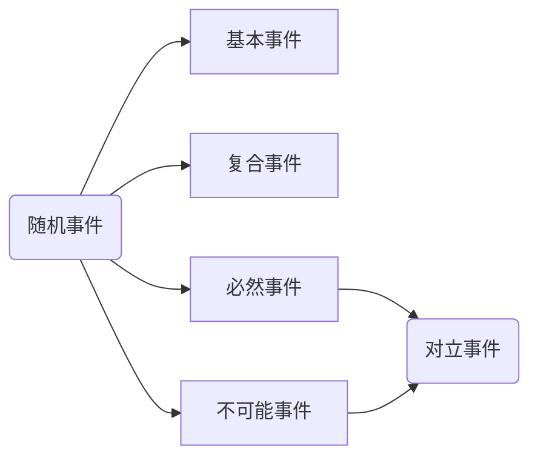
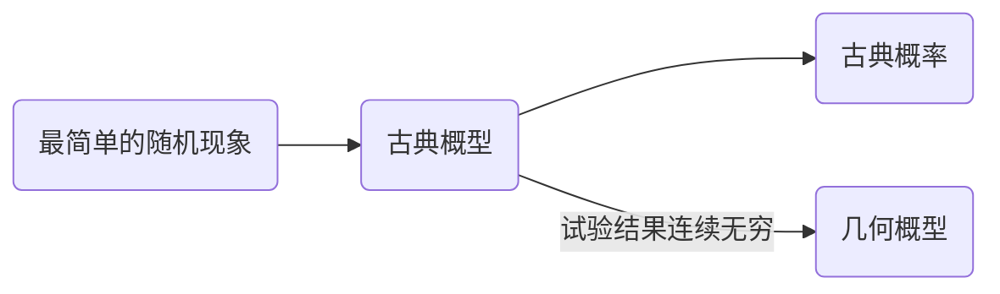
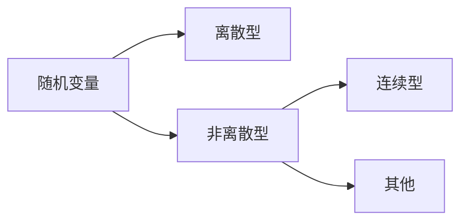

[TOC]

# 第一章 随机事件及其概率

#### 现象

>+ 确定性现象
>
>+ 必然现象

## 第一节 随机事件及样本空间

#### 随机试验

##### 条件

>+ 可以在相同的条件下重复地进行
>
>+ 每次试验的可能结果不止一个，并且能事先明确试验的所有可能的结果
>
>+  进行一次试验之前不能确定哪一个结果会出现，但可以肯定会出现上述所有可能结果中的一个

##### 说明

> + 随机试验简称为试验，是一个广泛的属于。它包括各种各样的科学实验，也包括对客观事物进行的“调查”、“观察”或“测量”等。
> + 随机试验通常用**E**来表示

##### 例

> + “抛掷一枚硬币，观察字母，花面出现的情况”
>    - 试验可以在相同的条件下重复进行
>    - 试验的所有可能的结果
>        - 字面
>        - 花面
>    - 进行一次试验之前不能确定哪一个结果会出现
>    
>    故为随机试验
>    
> + 抛掷一枚骰子，观察出现的点数
>
> + 从一批产品中，一次任选三件，记录出现正品与次品的件数
>
> + 记录某公共汽车站某时刻的等车人数
>
> + 考察某地区10月份的平均气温
>
> + 从一批灯泡中任选一只，测试其寿命

#### 样本空间

##### 定义

> + 随机试验E的所有可能的结果组成的集合称为E的**样本空间**，记为**S**

##### 说明

> + 试验不同，对应的样本空间也不同
> + 同一试验，若试验目的不同，则对应的样本空间也不同
> + 建立样本空间，事实上就是建立随机实现的数学模型。因此，一个样本空间可以包括许多内容不大相同的实际问题
>
> **所以在具体问题的研究中，描述与随机现象的第一步就是建立样本空间**

#### 样本点

> + 样本空间的元素，即试验E的每一个结果，称为**样本点**

##### 例

> + 投掷一枚硬币，观察字面，花面出现的情况
>
>    >记  ***H*****→**字面朝上， ***T*****→**花面朝上
>    >
>    >则  ***S*****1** **=** **{*H*,*T*}**
>    
> + 投掷一枚骰子，观察出现的点数
>
>    > ***S*****2** **=** **{1,2,3,4,5,6}**
>
> + 从一批产品中，一次任选三件，记录出现正品与次品的情况
>
>    > 记  ***N*** **→** 正品， ***D*** **→** 次品
>    >
>    > 则  ***S*****3** **=** **{*NNN*,*NND*,*NDN*,*DNN*,*NDD*,*DDN*,*DND*,*DDD*}**
>
> + 记录某公共汽车站某人上午某时刻的等车人数
>
>    > ***S*****4** **=** **{0,1,2,···}**
>
> + 考察某地区12月份的平均气温
>
>    > ***S*****5** **=** **{*t*|*T*1 < *t* < *T*2}**  **其中*t*为平均温度**
>
> + 从一批灯泡中任取一只，测试其寿命
>
>    > ***S*****6** **=** **{*t*|*t* ≥ 0}** **其中*t*为灯泡的寿命**

#### 随机事件

##### 基本概念

> **事件**  具有某一可观察特征的随机试验的结果称为事件
>
> + 随机事件
> + 必然事件
> + 不可能事件
>
> **随机事件** 随机试验E的样本空间S的子集成为E的随机事件，简称事件
>
> + **例** 投掷一枚骰子，观察出现的点数。试验中，骰子“出现1点”，“出现2点”，···，“不大于4”，“为偶数”等都为随机事件
>
> **基本事件** 由一个样本点组成的单点集
>
> + **例** “出现1点”，“出现2点”，···
>
> **必然事件** 随机试验中必然会出现的结果
>
> + **例** “点数不大于6”
>
> **不可能事件** 随机试验中不可能出现的结果
>
> + **例** “点数大于6”
>
> **必然事件的对立面是不可能事件，不可能事件的对立面是必然事件，他们互称为<big>对立事件</big>**

##### 随机试验、样本空间与随机事件的关系

|记号|概率论|集合论|
|:-:|:--:|:--:|
|***S***|样本空间，必然事件|空间|
|**∅**|不可能事件|空集|
|***e***|基本事件|元素|
|***A***|随机事件|子集|
|**$^{-}_{A}$**|*A*的对立事件|*A*的补集|
|***A*** **$\subset$** ***B***|*A*出现必然导致*B*出现|*A*是*B*的子集|
|***A = B***|事件*A*与事件*B*相等|集合*A*与集合*B*相等|
|***A $\cup$ B***|事件*A*与事件*B*的和|集合*A*与集合*B*的并集|
|***AB***|事件*A*与事件*B*的积事件|集合*A*与集合*B*的交集|
|***A - B***|事件*A*与事件*B*的差|*A*与*B*两集合的差集|
|             ***AB*** **= ∅**             |事件*A*与事件*B*互不相容|*A*与*B*两集合中没有相同的元素|

#### 定理

+ **若**事件$A_1$与$A_2$同时发生必导致事件$A$发生，**则**$P(A)\geq P(A_1)+P(A_2)-1$，证：

  > $\because A_1A_2\subset A$
  >
  > $\therefore P(A-A_1A_2)=P(A)-P(A_1A_2)\geq 0$
  >
  > $\therefore P(A)\geq P(A_1A_2)=P(A_1)+P(A_2)-P(A_1\cup A_2)\geq P(A_1)+P(A_2)-1$
+ $\overline{\cup^n_{i=1}A_i}=\cap^n_{i=1}\overline{A_i}$
+ $\overline{\cap^n_{i=1}A_i}=\cup^n_{i=1}\overline{A_i}$

### 例题

+ $P(A)=\ln a,P(B)=0.2,A\supset B$，求$a$的取值范围

  > + $P(B)<P(A)\Rightarrow 0.2<\ln a\Rightarrow e^{0.2}<a$
  > + $P(A)>0\Rightarrow \ln a\leq 1\Rightarrow$$\ a\leq e$
  >
  > $e^{0.2}<a$$\ \leq e$

+ 已知事件$A,B$满足$P(AB)=P(\overline A\ \overline B)$,且$P(A)=p$，求$P(B)$。
  > $\because P(AB)=P(A)+P(B)-P(A\cup B)$,
  > $\ \ \ P(\overline A\ \overline B)=P(\overline{A\cup B})=1-P(A\cup B)$,
  > $\ \ \ P(AB)=P(\overline A\ \overline B)$
  > $\therefore P(A)+P(B)=1$
  > 又$\because P(A)=p$
  > $\therefore P(B)=1-p$

## 第二节 频率与概率

#### 古典概型和几何概型

##### 古典概型 （等可能概型）

###### 定义

> + 试验的样本空间只包含有限个元素
> + 试验中每个基本事件发生的可能性相同

###### 计算公式

> + $P(A)\ =\ \frac{m}{n}\ =\ \frac{A所包含样本点的个数}{样本点总数}$

##### 几何概型

###### 定义

> + 试验的样本空间是某个区域
> + 任意一点落在度量（长度、面积、体积）相同的子区域是等可能的

###### 计算公式

> + $P(A)\ =\ \frac{S_{A}}{S}$

##### 小结

#### 频率与概率

##### 频率

###### 定义

> + 在相同条件下，进行了$n$次试验，在这$n$次试验中，事件$A$发生的次数$n_{A}$称为事件$A$发生的**频数**
> + 比值$\frac{n_{A}}{n}$称为事件$A$发生的**频率**，并记成$f_{n}(A)$

###### 计算公式

> + $f_{n}(A)\ =\ \frac{n_{A}}{n}$

###### 性质

> 设$A$是随机试验$E$的任一事件，则
>
> + $0\ \leq\ f_{n}(A)\ \leq\ 1$
> + $f_{n}(S)\ =\ 1$, $f_{n}(\phi)\ =\ 0$
> + 若$A_1,\ A_2,\ \cdots,\ A_k$是两两互不相容的事件，则$f_n(A_1\bigcup A_2\bigcup A_3\bigcup \cdots\bigcup A_k)\ =\ f_n(A_1)+f_n(A_2)+\cdots+f_n(A_k)$

##### 概率

###### 定义

> + 事件$A$发生的频率，当$n$较小时波动幅度比较大，当试验次数$n$逐渐增大时，事件$A$发生的频率趋于稳定值，总是稳定在一个确定数$p$附近，而且偏差随着试验次数的增大而越来越小，频率的这种稳定性说明刻画随机事件$A$**发生的可能性大小的数——概率的客观存在性**。这个稳定值从本质上反映了事件在试验中出现可能性的大小。它就是事件的**概率**。

###### 统计定义

> + 在相同条件下重复进行$n$次试验，若事件$A$发生的频率$f_n(A)\ =\ \frac{n_A}{n}$随着试验次数$n$的增大而稳定在某个常数$p(0\leq p\leq 1)$附近摆动，则称$p$为事件的概率，记为$P(A)$

###### 条件

> 集合$P$应满足下列条件：
>
> 1. **非负性**： 对于每一个事件$A$，有$P(A)\geq0$
> 2. **规范性**：对于必然事件$S$，有$P(S)=1$
> 3. **可列可加性**：设$A_1,A_2,\cdots$是两两互不相容的事件，即对于$i\neq j; A_iA_j=\phi;i,j=1,2,\cdots$，则有$P(A_1\bigcup A_2\bigcup\cdots)=P(A_1)+P(A_2)+\cdots$

## 第三节 条件概率与贝努利概型

#### 条件概率

###### 定义

> + 设$A, B$为事件，若$P(A)>0$，则称$P(B|A)=\frac{P(AB)}{P(A)}$为$A$发生条件下$B$的条件概率，简称**条件概率**

###### 前提

> + $P(A)>0$

###### 性质

> + 条件概率也是概率，它满足概率的公理化定义（验证）

###### 计算方法

> + 古典概型可用缩减样本空间法
> + 其他概型用定义有关公式

###### 概率乘法公式

> + 若$P(A)>0$，则$P(AB)=P(A)P(B|A)$
> + 若$P(A_1A_2\cdots A_{n-1})>0$，则$P(A_1A_2\cdots A_n)=P(A_1)P(A_2|A_1)\cdots P(A_n|A_1\cdots A_{n-1})$

##### 全概率公式

> + 思想：化复杂事件概率为多个简单事件概率。
>
>   设$B_1,B_2,\cdots,B_n$为互不相容，且$\bigcup^{n}_{i=1}B_i=\Omega$。若$P(B_i)>0,i=1,2,\cdots,n$，则有$P(A)=\sum^{n}_{i=1}P(B_i)P(A|B_i)$
>
>   任意事件的概率可表示为其条件概率的**加权平均**，权重为每个条件发生的概率
>
> + 简单形式（n=2)
>
>   $P(A)=P(B)P(A|B)+P(\bar{B})P(A|\bar{B})$. 其中$0<P(B)<1$.

##### Bayes公式

> + 设$B_1,B_2,\cdots ,B_n$互不相容，且$\bigcup^{n}_{i=1}=\Omega$。若$P(B_i)>0,i=1,2,\cdots,n,P(A)>0$，则$P(B_i|A)=\frac{P(B_iA)}{P(A)}=\frac{P(B_i)P(A|B_i)}{\sum^{n}_{j=1}P(B_j)P(A|B_j)}$

###### 全概率公式和Bayes公式的对比

> + 全概率公式：知因导果，求复杂事件概率
>
> + Bayes公式：执果索因，求条件概率
>
>   二者成立的条件略有不同

##### 独立

> + 若对任意的$1\leq i<j<k<\cdots\leq n$，
>
>   $\left\{ \begin{matrix}P(A_i)P(A_j)=P(A_i)P(A_j)\\P(A_iA_jA_k)=P(A_i)P(A_j)P(A_k)\\\vdots\\P(A_1A_2\cdots A_n)=P(A_1)P(A_2)\cdots P(A_n)\\\end{matrix}\right.$
>
>   成立，则称事件$A_1, A_2,\cdots ,A_n$相互独立

#### 贝努利试验

###### 公式

> + 在$n$重贝努利试验中，$A$出现$k$次的概率为$P(B_k)=C^{k}_{n}p^kq^{n-k},\ (k=0,1,\cdots,n)$

# 第二章 随机变量及其分布

## 第一节 离散型随机变量及其分布

#### 随机变量

##### 定义

> 设$E$是随机试验，它的样本空间是$U=\{e\}$。如果对于每一个$e\in U$，有一个实数$X(e)$与之对应，这样就得到一个定义在$U$上的单值实值函数$X(e)$，称$X(e)$为**随机变量**。

#### 概率分布律

> 表示离散型随机变量$X$的所有不同取值$x_i(i=1,2,\cdots,n,\cdots)$与相应概率的关系式$P\{X=x_i\}=p_i(i=1,2,\cdots,n,\cdots)$或$$X\sim\begin{pmatrix} x_1\cdots x_i\cdots \\ p_i\cdots p_i\cdots\end{pmatrix}$$称为离散型随机变量的**概率分布律**

#### 常用离散型随机变量及其分布律

> + （0-1)分布（又称两点分布）
>
>   $P\{X=k\}=p^k(1-p)^{1-k}\ \ (k=0,1;0<p<1)$
>
> + 二项分布
>
>   $P\{X=k\}=C_n^kp^k(1-p)^{n-k}=\frac{n!}{k!(n-k)!}p^kq^{n-k}$
>
> + 泊松(Poisson)分布
>
>   $P\{X=k\}=\frac{\lambda^k}{k!}e^{-\lambda}\ \ (k=0,1,2,\cdots)(\lambda>0)$
>
>   若$n$比较大，有$C_n^kp^k(1-p)^{n-k}\approx\frac{\lambda^k}{k!}e^{-\lambda}$成立。其中$\lambda=np$。
>
> + 几何分布 进行重复独立试验，每次试验事件$A$发生的概率为$p(0<p<1)$，设$X$表示事件$A$首次发生时的试验次数，则称$X$服从**几何分布**
>
>   $P\{X=k\}=p(1-p)^{k-1}(k=1,2,\cdots,n,\cdots)$
>
> + 超几何分布  一个口袋里装有$a$个红球、$b$个白球，从中任取$m$个球$(1\leq m\leq a+b)$，设$X$表示从中取出的红球的个数，则称$X$服从**超几何分布**
>
>   $P(X=k)=\frac{C_a^kC_b^{m-k}}{C_{a+b}^m}(1\leq k\leq min\{m,a\})$

#### 分布函数

##### 定义

> 对任意试试$x$，随机变量$X$的取值不超过$x$的累计概率$P\{X\leq x\}$是实数$x$的函数，称为随机变量$X$的累积分布函数(cumulative distrubution function)或累积概率，简称$X$的**分布函数**，记作$F_X(x)$或简记作$F(x)$，即$F(x)=P\{X\leq x\}$
>
> 若$F(x)$是随机变量$X$分布函数，对任意实数$x_1,x_2(x1<x_2)$，有$P\{x_1<X\leq x_2\}=P\{X\leq x_2\}-P\{X\leq x_1\}=F(x_2)-F(x_1)$
>
> 即分布函数$F(x)$可以表示随机变量$X$落在任一区间$(x_1,x_2]$上的概率，所以分布函数可以完整地描述随机变量概率分布的规律性。

##### 性质

> + $0\leq F(x)\leq1\ \ (-\infty<x<+\infty)$
> + 若$x_1<x_2$，则$F(x_1)\leq F(x_2)$，即任一分布函数都是单调不减的
> + $F(-\infty)=\lim_{x \to -\infty}F(x)=0$，$F(+\infty)=\lim_{x\to+\infty}F(x)=1$
> + 右连续，即$\lim_{x\to x_0+0}F(x)=F(x_0)$

## 第二节 连续型随机变量及其分布
#### 密度函数

##### 定义

> 设$F(x)$是随机变量$X$的分布函数，若对任意的实数$x$，存在$f(x)>0$，使$F(x)=\int_{-\infty}^xf(t)dt$，则称$X$为连续型随机变量，称$f(x)$为$X$的**密度函数**（也称为**分布密度**或**概率密度**），并称$X$的分布为**连续型分布**

##### 性质

> + $f(x)\geq0\ \ (-\infty<x<+\infty)$
> + $\int_{-\infty}^{+\infty}f(x)dx=1$
> + $P\{a<x\leq b\}=\int_a^bf(x)dx=F(b)-F(a)$
> + 若$f(x)$在$x$处连续，则$F'(x)=f(x)$
> + 连续型随机变量$X$取任一指定实数值$a$的概率都等于0。即$P\{X=a\}=0$

#### 常用离散型随机变量的分布

> + 均匀分布 若$X$的密度函数为$f(x)=\left\{\begin{matrix}\frac{1}{b-a},&x\in[a,b]\\0,&x<a或x>b\end{matrix}\right.$则称$X$服从区间$[a,b]$上的**均匀分布**(uniform distribution)，记作$X\in U[a,b]$。$X$的分布函数为$F(x)=\left\{\begin{array}\\0,&x<a\\\frac{x-a}{b-a},&a\leq x<b\\1,&x\geq b\end{array}\right.$
> + 指数分布 若$X$的密度函数为$f(x)=\left\{\begin{array}\\\lambda e^{-\lambda x},&x>0,\lambda>0\\0,&其他\end{array}\right.$则称$X$服从参数为$\lambda$的**指数分布**，记为$X\sim E(\lambda)$。其分布函数为$F(x)=\left\{\begin{array}\\0,&x<0\\1-e^{-\lambda x},&x\geq0\end{array}\right.$
> + 正态分布 若$X$的密度函数为$f(x)=\frac{1}{\sigma\sqrt{2\pi}}e^{-\frac{(x-\mu)^2}{2\sigma^2}},\ \ \mu\in R,\sigma>0,-\infty<x<+\infty$则称$X$服从参数为$\mu,\sigma$的**正态分布**，记为$N(0,1)$。

## 第三节 二维随机变量及其分布m

#### 二维随机变量

##### 定义

> 设$\Omega$为随机试验$E$的样本空间，$X,Y$是定义在$\Omega$上的一对有序的随机变量，则称$(X,Y)$为**二维随机变量**

#### 联合分布函数

##### 定义

> 对于任一对师叔$x,y$，称二元函数$F(x,y)=P\{X\leq x,Y\leq y\}$为$(X,Y)$的**联合分布函数*joint distribution function***，简称为$(X,Y)$的**分布函数**。

##### 性质

> + $0\leq F(x,y)\leq 1$
>
> + $F(x,y)$对于$x,y$都是单调不减的
>
> + $F(-\infin,y)=F(x,-\infin)=F(-\infin,-\infin)=0$
>
>   $F(+\infin, +\infin)=1$
>
> + $F(x,y)$对于$x,y$均右连续
>
> + 对于任意的$x_1,x_2,x_1,y_2$，且$x_1\leq x2, y1\leq y2$均有$P\{x_1<X\leq x_2, y_1<Y\leq y2\}=F(x_2,y_2)-F(x_2,y_1)-F(x_1,y_2)+F(x_1,y_1)\geq 0$成立

#### 联合分布律

##### 定义

> 如果二维随机变量$(X,Y)$中的$X$与$Y$分别都是离散型随机变量，即$(X,Y)$可能的取值为有限对或可列无限对，则称$(X,Y)$为二维离散型随机变量。称随机事件$\{X=x_i,Y=y_i\}$（即事件$\{X=x_i\}\cap\{Y=y_i\}$）的概率$P\{X=x_i,Y=y_i\}=p_{ij}(i,j=1,2,\cdots)$为$(X,Y)$的**联合分布律**或**联合分布*joint distribution***。

##### 性质

> + $0\leq p_{ij}\leq 1(i=1,2,\cdots,m,\cdots;j=1,2,\cdots,n,\cdots)$
> + $\sum_{i,j}p_{i,j}=1$

$(X,Y)$的联合

**分布函数**为$F(x,y)=\sum_{x_i\leq x,y_j\leq y}p_{ij}$

#### 二维连续型随机变量、联合密度

##### 定义

> 若二维随机变量$(X,Y)$的分布函数$F(x,y)$对任意$x,y$有$F(x,y)=\int_{-\infin}^{x}dx\int_{-\infin}^{y}f(x,y)dy(-\infin<x<+\infin,-\infin<y<+\infin)$其中$f(x,y)\geq0$则称$(X,Y)$为**二维连续型随机变量**，称$f(x,y)$为$(X,Y)$的联合密度函数，简称**联合密度**。

##### 性质

> $(X,Y)$的联合密度具有下列性质：
>
> + $f(x,y)\geq0$
> + $\int_{-\infin}^{+\infin}dx\int_{-\infin}^{+\infin}f(x,y)dy=1$

## 第四节 随机变量函数的分布

